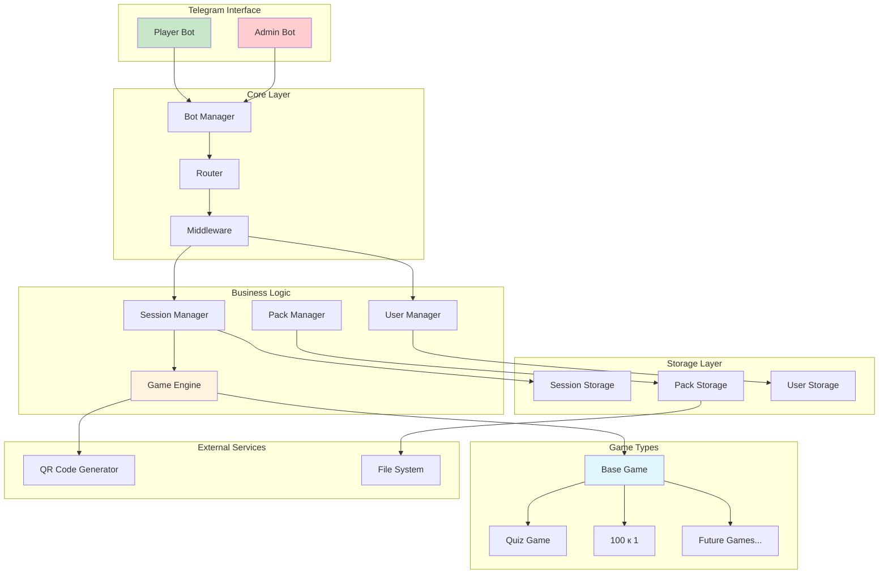
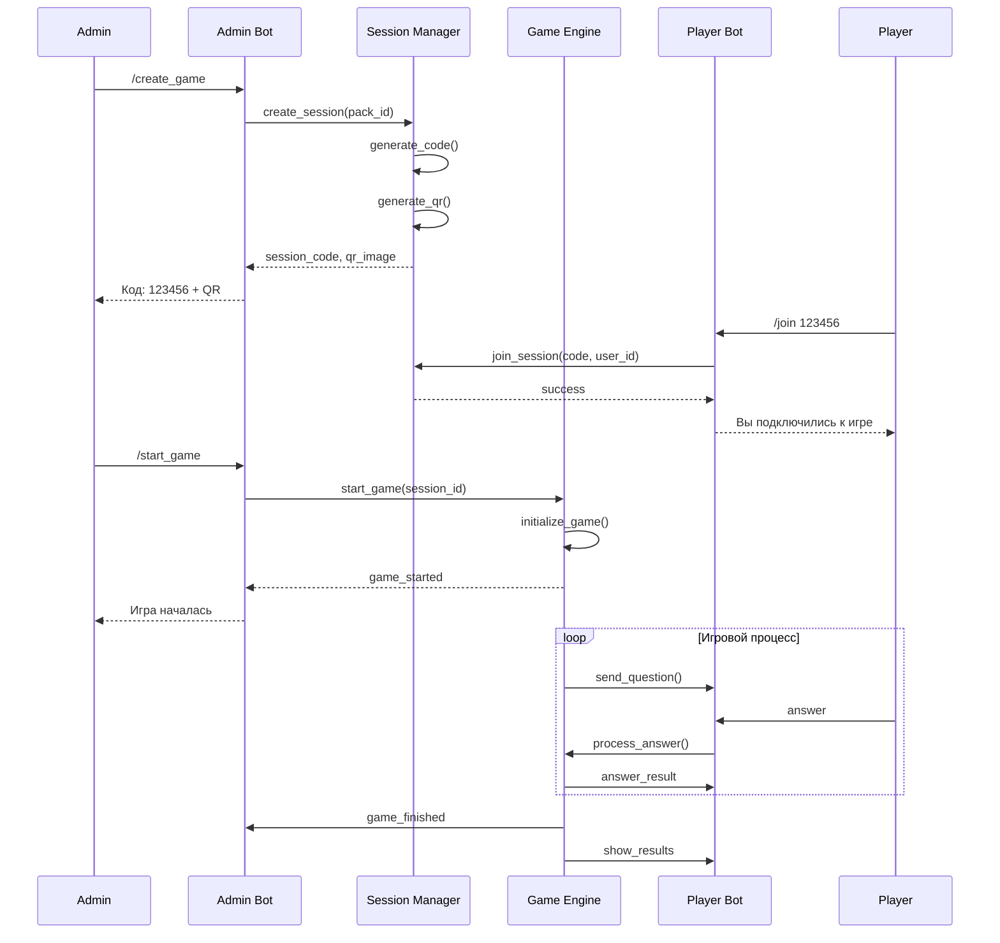
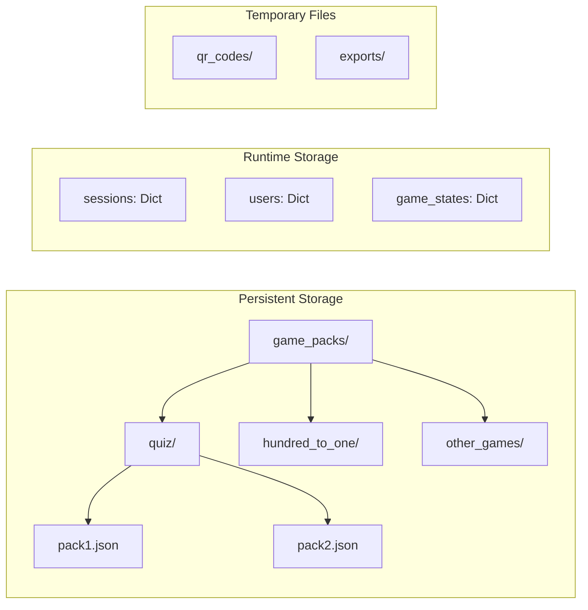

# Архитектура телеграм-бота для игр

## Обзор системы

Система представляет собой модульный телеграм-бот для проведения различных игр с поддержкой множественных сессий и двухботовой архитектуры (админ + игроки).

## Архитектурная диаграмма



## Компоненты системы

### 1. Core Layer (Ядро системы)

#### Bot Manager (`src/core/bot.py`)
- Инициализация и настройка ботов
- Управление жизненным циклом приложения
- Обработка ошибок и логирование

#### Router (`src/core/router.py`)
- Маршрутизация команд между админом и игроками
- Определение контекста пользователя (админ/игрок)
- Middleware для авторизации

### 2. Business Logic Layer

#### Session Manager (`src/sessions/manager.py`)
```python
class SessionManager:
    - create_session(game_pack_id, admin_id) -> Session
    - join_session(session_code, user_id) -> bool
    - start_session(session_id) -> bool
    - end_session(session_id) -> GameResults
    - generate_session_code() -> str
    - generate_qr_code(session_code) -> bytes
```

#### Game Engine (`src/games/engine.py`)
```python
class GameEngine:
    - load_game(game_type, pack_data) -> BaseGame
    - process_game_action(session_id, user_id, action) -> ActionResult
    - get_game_state(session_id) -> GameState
    - calculate_results(session_id) -> Results
```

#### User Manager (`src/users/manager.py`)
```python
class UserManager:
    - register_user(telegram_id, username) -> User
    - get_user(telegram_id) -> User
    - is_admin(telegram_id) -> bool
    - get_user_sessions(telegram_id) -> List[Session]
```

### 3. Game Types Layer

#### Base Game (`src/games/base.py`)
```python
class BaseGame(ABC):
    @abstractmethod
    async def initialize(self, pack_data: dict) -> None
    
    @abstractmethod
    async def start_round(self) -> RoundData
    
    @abstractmethod
    async def process_answer(self, user_id: int, answer: str) -> AnswerResult
    
    @abstractmethod
    async def next_round(self) -> Optional[RoundData]
    
    @abstractmethod
    async def finish_game(self) -> GameResults
    
    @abstractmethod
    async def get_current_state(self) -> GameState
```

#### Quiz Game (`src/games/quiz/game.py`)
- Реализация викторины
- Поддержка различных типов вопросов
- Система очков и таймеров

### 4. Storage Layer

#### Session Storage (`src/storage/session_storage.py`)
```python
class SessionStorage:
    - create_session(session: Session) -> str
    - get_session(session_id: str) -> Optional[Session]
    - update_session(session_id: str, data: dict) -> bool
    - delete_session(session_id: str) -> bool
    - get_active_sessions() -> List[Session]
```

#### Pack Storage (`src/storage/pack_storage.py`)
```python
class PackStorage:
    - load_pack(pack_id: str) -> Optional[GamePack]
    - save_pack(pack: GamePack) -> str
    - list_packs() -> List[GamePackInfo]
    - delete_pack(pack_id: str) -> bool
```

## Модели данных

### Core Models (`src/models/`)

```python
# User Model
class User(BaseModel):
    telegram_id: int
    username: Optional[str]
    first_name: Optional[str]
    is_admin: bool = False
    created_at: datetime

# Session Model
class Session(BaseModel):
    id: str
    code: str
    admin_id: int
    game_pack_id: str
    game_type: str
    status: SessionStatus
    players: List[int]
    current_round: int
    started_at: Optional[datetime]
    ended_at: Optional[datetime]
    results: Optional[dict]

# Game Pack Model
class GamePack(BaseModel):
    id: str
    name: str
    description: str
    game_type: str
    data: dict
    created_by: int
    created_at: datetime
```

## JSON-формат игровых паков

### Quiz Pack Format
```json
{
  "name": "Викторина по истории России",
  "description": "Вопросы о ключевых событиях российской истории",
  "type": "quiz",
  "settings": {
    "time_per_question": 30,
    "show_correct_answer": true,
    "allow_skip": false,
    "points_per_correct": 10,
    "penalty_for_wrong": -2
  },
  "questions": [
    {
      "id": 1,
      "question": "В каком году была основана Москва?",
      "type": "multiple_choice",
      "options": ["1147", "1156", "1174", "1185"],
      "correct_answer": 0,
      "explanation": "Москва была основана в 1147 году князем Юрием Долгоруким",
      "points": 10,
      "time_limit": 30
    },
    {
      "id": 2,
      "question": "Кто был первым царем всея Руси?",
      "type": "text_input",
      "correct_answers": ["Иван Грозный", "Иван IV", "Иван Васильевич"],
      "case_sensitive": false,
      "points": 15
    }
  ]
}
```

### "100 к 1" Pack Format
```json
{
  "name": "100 к 1: Семейные темы",
  "description": "Популярные ответы на семейные темы",
  "type": "hundred_to_one",
  "settings": {
    "teams_count": 2,
    "rounds_count": 3,
    "final_round": true
  },
  "rounds": [
    {
      "question": "Что люди обычно забывают дома?",
      "answers": [
        {"text": "Ключи", "points": 40},
        {"text": "Телефон", "points": 25},
        {"text": "Кошелек", "points": 15},
        {"text": "Документы", "points": 10},
        {"text": "Очки", "points": 6},
        {"text": "Зонт", "points": 4}
      ]
    }
  ]
}
```

## Workflow диаграммы

### Создание и запуск игры


### Архитектура хранения данных



## Конфигурация системы

### Environment Variables
```env
# Bot Configuration
ADMIN_BOT_TOKEN=<admin_bot_token>
PLAYER_BOT_TOKEN=<player_bot_token>
ROOT_ID=<admin_telegram_id>

# Storage Configuration
GAME_PACKS_DIR=./game_packs
TEMP_DIR=./temp
QR_CODES_DIR=./temp/qr_codes

# Game Settings
SESSION_CODE_LENGTH=6
SESSION_TIMEOUT_MINUTES=60
MAX_PLAYERS_PER_SESSION=50

# Logging
LOG_LEVEL=INFO
LOG_FILE=./logs/bot.log
```

## План реализации

### Фаза 1: Основа (1-2 дня)
1. ✅ Настройка конфигурации и окружения
2. ✅ Базовые модели данных (Pydantic)
3. ✅ Core Bot Manager с двухботовой архитектурой
4. ✅ Базовая система логирования

### Фаза 2: Игровой движок (2-3 дня)
1. ✅ BaseGame абстрактный класс
2. ✅ Game Engine для управления играми
3. ✅ Session Manager для управления сессиями
4. ✅ Quiz Game как первая реализация

### Фаза 3: Админ-панель (1-2 дня)
1. ✅ Команды создания игр
2. ✅ Управление игровыми паками
3. ✅ Запуск и остановка сессий
4. ✅ Генерация QR-кодов

### Фаза 4: Игровой процесс (2-3 дня)
1. ✅ Подключение игроков по коду/QR
2. ✅ Обработка игровых действий
3. ✅ Система очков и результатов
4. ✅ Отображение статистики

### Фаза 5: Расширения (1-2 дня)
1. ✅ Игра "100 к 1"
2. ✅ Экспорт результатов
3. ✅ Улучшенная админ-панель
4. ✅ Тестирование и отладка

## Технические детали

### Безопасность
- Валидация всех входных данных через Pydantic
- Проверка прав доступа для админских команд
- Ограничение количества игроков в сессии
- Автоматическое завершение неактивных сессий

### Производительность
- Асинхронная обработка команд
- Кэширование часто используемых данных
- Оптимизация работы с файловой системой
- Batch-обработка массовых операций

### Масштабируемость
- Модульная архитектура для добавления новых игр
- Конфигурируемые лимиты и настройки
- Возможность горизонтального масштабирования
- Абстракция слоя хранения данных

Эта архитектура обеспечивает гибкость, масштабируемость и простоту расширения для добавления новых типов игр в будущем.