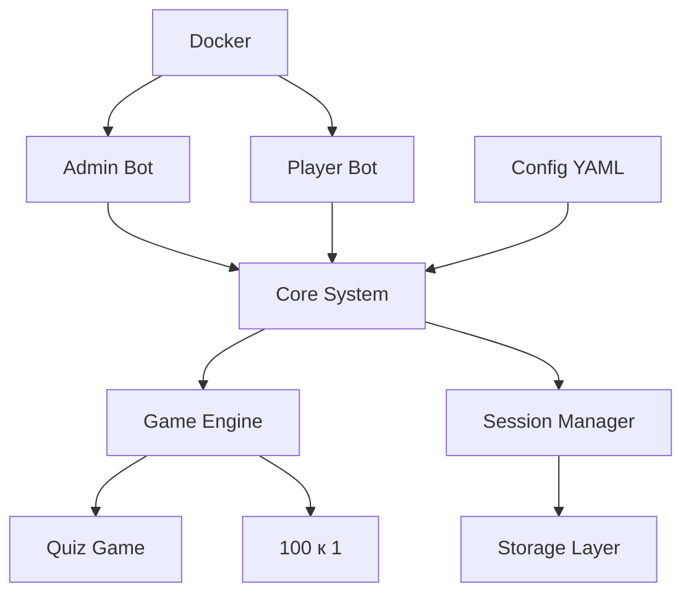

# Телеграм-бот для игр

Модульная система для проведения различных игр через Telegram с поддержкой множественных сессий, Docker-контейнеризации и гибкой конфигурации.

## 🎯 Основные возможности

- **Модульная архитектура** - легкое добавление новых типов игр
- **Гибкие режимы работы** - admin/player/both режимы
- **Docker-поддержка** - контейнеризация для легкого развертывания
- **Конфигурация через YAML** - централизованные настройки
- **Множественные сессии** - одновременное проведение нескольких игр
- **QR-коды** - быстрое подключение к играм
- **JSON игровые паки** - простое создание игр
- **Система результатов** - подсчет очков и рейтинги

## 🎮 Поддерживаемые игры

### ✅ Реализованные
- **Викторины** - различные типы вопросов с таймерами
- **100 к 1** - командная игра с популярными ответами (в разработке)

### 🔄 Планируемые
- Своя игра
- Что? Где? Когда?
- Крокодил
- Alias

## 🏗️ Архитектура



## 📋 Требования

- Python 3.11+
- Docker (опционально)
- Telegram боты от @BotFather

## 🚀 Быстрый старт

### Вариант 1: Docker (рекомендуется)

```bash
# 1. Настройка конфигурации
make setup

# 2. Отредактируйте .env файлы с токенами ботов

# 3. Сборка и запуск
make build
make run

# Или для тестирования с двумя ботами
make test
```

### Вариант 2: Локальный запуск

```bash
# 1. Установка зависимостей
pip install -r requirements.txt

# 2. Настройка
cp .env.example .env
# Отредактируйте .env файл

# 3. Запуск
python run.py
```

## ⚙️ Конфигурация

### Основные настройки (.env)

```env
# Токены ботов (обязательно)
ADMIN_BOT_TOKEN=your_admin_bot_token
PLAYER_BOT_TOKEN=your_player_bot_token
ROOT_ID=your_telegram_id

# Режим работы
MODE=both  # both/admin/player
```

### Расширенные настройки (config.yaml)

```yaml
game:
  session_code_length: 6
  max_players_per_session: 50
  session_timeout_minutes: 60

logging:
  level: "INFO"
  file: "./logs/bot.log"

# И многое другое...
```

## 🐳 Docker

### Режимы запуска

```bash
# Полный режим (оба бота)
docker-compose --profile full up

# Только админский бот
docker-compose up game-bot-admin

# Только игровой бот  
docker-compose up game-bot-player

# Тестирование (оба бота раздельно)
docker-compose up game-bot-admin game-bot-player
```

### Makefile команды

```bash
make help          # Список команд
make build         # Сборка образа
make test          # Тестирование
make logs          # Просмотр логов
make clean         # Очистка
```

## 🧪 Тестирование с одним аккаунтом

### Настройка для тестирования

1. **Создайте двух ботов в @BotFather:**
   - Админский бот (для управления)
   - Игровой бот (для участия)

2. **Настройте .env.admin:**
   ```env
   ADMIN_BOT_TOKEN=your_admin_bot_token
   PLAYER_BOT_TOKEN=your_admin_bot_token
   ROOT_ID=your_telegram_id
   MODE=admin
   ```

3. **Настройте .env.player:**
   ```env
   ADMIN_BOT_TOKEN=your_player_bot_token
   PLAYER_BOT_TOKEN=your_player_bot_token
   ROOT_ID=0
   MODE=player
   ```

4. **Запустите тестирование:**
   ```bash
   make test
   ```

## 📖 Документация

- [**Архитектура системы**](ARCHITECTURE.md) - детальное описание компонентов
- [**План реализации**](IMPLEMENTATION_PLAN.md) - пошаговый план разработки
- [**Форматы игр**](GAME_FORMATS.md) - JSON-схемы для игровых паков
- [**Руководство по тестированию**](TESTING_GUIDE.md) - стратегия тестирования
- [**Docker руководство**](DOCKER_GUIDE.md) - работа с контейнерами
- [**Быстрый старт**](QUICK_START.md) - пошаговая инструкция

## 🎯 Использование

### Для администратора

1. **Создание игровой сессии:**
   ```
   /create_session quiz_history_russia
   ```

2. **Запуск игры:**
   ```
   /start_game session_ABC123_1234567890
   ```

3. **Завершение игры:**
   ```
   /end_game session_ABC123_1234567890
   ```

### Для игроков

1. **Подключение к игре:**
   ```
   /join ABC123
   ```

2. **Ответы на вопросы:**
   - Отправляйте ответы обычными сообщениями
   - Следите за таймером

## 🎮 Создание игровых паков

### Викторина

```json
{
  "name": "Моя викторина",
  "type": "quiz",
  "questions": [
    {
      "question": "2 + 2 = ?",
      "type": "multiple_choice",
      "options": ["3", "4", "5", "6"],
      "correct_answer": 1,
      "points": 10
    }
  ]
}
```

### 100 к 1

```json
{
  "name": "Моя игра 100 к 1",
  "type": "hundred_to_one",
  "rounds": [
    {
      "question": "Что едят на завтрак?",
      "answers": [
        {"text": "Каша", "points": 40},
        {"text": "Яйца", "points": 30}
      ]
    }
  ]
}
```

## 🔧 Разработка

### Структура проекта

```
src/
├── core/           # Ядро системы
├── games/          # Игровые модули
├── models/         # Модели данных
├── handlers/       # Обработчики команд
├── storage/        # Слой хранения
└── utils/          # Утилиты
```

### Добавление новой игры

1. Создайте класс, наследующий от `BaseGame`
2. Реализуйте абстрактные методы
3. Зарегистрируйте в `GameEngine`
4. Создайте JSON-схему для паков

## 🧪 Тестирование

### Запуск тестов

```bash
# Все тесты
pytest

# С покрытием
pytest --cov=src --cov-report=html

# Только unit тесты
pytest tests/unit/
```

### Тестирование с Docker

```bash
# Запуск тестовых контейнеров
make test

# Просмотр логов
make logs-admin
make logs-player
```

## 📊 Мониторинг

### Логирование

Система ведет подробные логи:
- Создание/завершение сессий
- Подключение игроков
- Игровые события
- Ошибки системы

### Метрики

- Количество активных сессий
- Среднее время игры
- Популярность игровых паков
- Статистика ошибок

## 🔒 Безопасность

- Валидация всех входных данных
- Проверка прав администратора
- Ограничения на количество игроков
- Автоматическое завершение неактивных сессий

## 🚀 Развертывание

### Docker Compose

```bash
# Продакшен
docker-compose --profile full up -d

# Мониторинг
docker-compose logs -f
```

### Systemd

```ini
[Unit]
Description=Game Telegram Bot
After=network.target

[Service]
Type=simple
User=gamebot
WorkingDirectory=/opt/game-telegram
ExecStart=/usr/local/bin/docker-compose up
Restart=always

[Install]
WantedBy=multi-user.target
```

## 🤝 Участие в разработке

1. Форкните репозиторий
2. Создайте ветку для новой функции
3. Напишите тесты
4. Отправьте Pull Request

### Стиль кода

- Используйте Black для форматирования
- Следуйте PEP 8
- Добавляйте docstrings к функциям
- Покрытие тестами > 80%

## 📝 Лицензия

MIT License - см. файл [LICENSE](LICENSE)

## 🆘 Поддержка

- **Issues** - для багов и предложений
- **Discussions** - для вопросов и обсуждений
- **Wiki** - дополнительная документация

## 🎉 Благодарности

- Команде python-telegram-bot за отличную библиотеку
- Сообществу разработчиков за идеи и фидбек

---

**Версия:** 2.0.0  
**Статус:** Готов к использованию  
**Последнее обновление:** Январь 2025