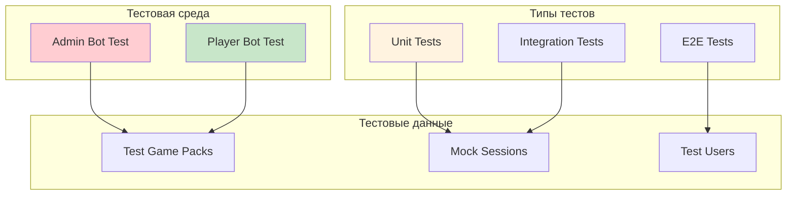

# Руководство по тестированию телеграм-бота для игр

## Обзор

Этот документ описывает стратегию тестирования системы телеграм-бота для игр, включая настройку тестовой среды с двумя ботами.

## Архитектура тестирования



## Настройка тестовой среды

### 1. Создание тестовых ботов

#### Админский бот
```env
# .env.admin
ADMIN_BOT_TOKEN=<admin_bot_token>
PLAYER_BOT_TOKEN=<player_bot_token>
ROOT_ID=<your_telegram_id>
ENVIRONMENT=test
```

#### Игровой бот (для тестирования)
```env
# .env.player
ADMIN_BOT_TOKEN=<admin_bot_token>
PLAYER_BOT_TOKEN=<player_bot_token>
ROOT_ID=0  # Отключаем админские права
ENVIRONMENT=test
```

### 2. Структура тестов

```
tests/
├── unit/
│   ├── test_models.py
│   ├── test_games/
│   │   ├── test_base_game.py
│   │   ├── test_quiz_game.py
│   │   └── test_hundred_to_one.py
│   ├── test_storage/
│   │   ├── test_session_storage.py
│   │   ├── test_pack_storage.py
│   │   └── test_user_storage.py
│   └── test_utils/
│       ├── test_qr_generator.py
│       └── test_validators.py
├── integration/
│   ├── test_session_flow.py
│   ├── test_game_flow.py
│   └── test_bot_handlers.py
├── e2e/
│   ├── test_full_game_cycle.py
│   └── test_multi_user_scenarios.py
├── fixtures/
│   ├── game_packs/
│   │   ├── test_quiz.json
│   │   └── test_hundred_to_one.json
│   └── mock_data.py
└── conftest.py
```

## Unit Tests

### Тестирование моделей

```python
# tests/unit/test_models.py
import pytest
from datetime import datetime
from src.models.user import User
from src.models.session import Session
from src.models.enums import SessionStatus

class TestUserModel:
    def test_user_creation(self):
        user = User(
            telegram_id=123456789,
            username="testuser",
            first_name="Test",
            is_admin=False
        )
        
        assert user.telegram_id == 123456789
        assert user.username == "testuser"
        assert user.is_admin is False
        assert isinstance(user.created_at, datetime)
        
    def test_admin_user(self):
        admin = User(
            telegram_id=987654321,
            username="admin",
            first_name="Admin",
            is_admin=True
        )
        
        assert admin.is_admin is True

class TestSessionModel:
    def test_session_creation(self):
        session = Session(
            id="test_session",
            code="ABC123",
            admin_id=123,
            game_pack_id="pack_1",
            game_type="quiz",
            status=SessionStatus.WAITING,
            players=[]
        )
        
        assert session.code == "ABC123"
        assert session.status == SessionStatus.WAITING
        assert len(session.players) == 0
```

### Тестирование игр

```python
# tests/unit/test_games/test_quiz_game.py
import pytest
from src.games.quiz.game import QuizGame
from src.models.enums import GameState

class TestQuizGame:
    @pytest.fixture
    def quiz_data(self):
        return {
            "name": "Test Quiz",
            "type": "quiz",
            "questions": [
                {
                    "id": 1,
                    "question": "2 + 2 = ?",
                    "type": "multiple_choice",
                    "options": ["3", "4", "5", "6"],
                    "correct_answer": 1,
                    "points": 10
                }
            ],
            "settings": {
                "time_per_question": 30,
                "points_per_correct": 10
            }
        }
    
    @pytest.fixture
    def quiz_game(self, quiz_data):
        return QuizGame("test_session", quiz_data)
    
    async def test_game_initialization(self, quiz_game):
        await quiz_game.initialize()
        assert quiz_game.game_state == GameState.READY
        
    async def test_start_round(self, quiz_game):
        await quiz_game.initialize()
        round_data = await quiz_game.start_round()
        
        assert round_data is not None
        assert round_data.question == "2 + 2 = ?"
        assert len(round_data.options) == 4
        
    async def test_correct_answer(self, quiz_game):
        await quiz_game.initialize()
        await quiz_game.start_round()
        quiz_game.add_player(123)
        
        result = await quiz_game.process_answer(123, "2")  # Правильный ответ (индекс 1)
        
        assert result.success is True
        assert result.is_correct is True
        assert result.points == 10
        assert quiz_game.players_scores[123] == 10
        
    async def test_wrong_answer(self, quiz_game):
        await quiz_game.initialize()
        await quiz_game.start_round()
        quiz_game.add_player(123)
        
        result = await quiz_game.process_answer(123, "1")  # Неправильный ответ
        
        assert result.success is True
        assert result.is_correct is False
        assert result.points == 0
```

## Integration Tests

### Тестирование потока сессий

```python
# tests/integration/test_session_flow.py
import pytest
from src.sessions.manager import SessionManager
from src.storage.pack_storage import PackStorage
from tests.fixtures.mock_data import create_test_pack

class TestSessionFlow:
    @pytest.fixture
    async def session_manager(self):
        return SessionManager()
    
    @pytest.fixture
    async def test_pack(self):
        pack_storage = PackStorage()
        pack_data = create_test_pack("quiz")
        pack_id = await pack_storage.save_pack(pack_data)
        return pack_id
    
    async def test_create_and_join_session(self, session_manager, test_pack):
        # Создание сессии
        session = await session_manager.create_session(test_pack, admin_id=123)
        assert session is not None
        assert len(session.code) == 6
        
        # Подключение игрока
        success = await session_manager.join_session(session.code, user_id=456)
        assert success is True
        
        # Проверка, что игрок добавлен
        updated_session = await session_manager.get_session_info(session.id)
        assert 456 in updated_session.players
        
    async def test_start_and_end_session(self, session_manager, test_pack):
        # Создание и запуск сессии
        session = await session_manager.create_session(test_pack, admin_id=123)
        await session_manager.join_session(session.code, user_id=456)
        
        start_success = await session_manager.start_session(session.id)
        assert start_success is True
        
        # Завершение сессии
        results = await session_manager.end_session(session.id)
        assert results is not None
```

## E2E Tests

### Полный цикл игры

```python
# tests/e2e/test_full_game_cycle.py
import pytest
import asyncio
from telegram.ext import Application
from tests.fixtures.bot_client import BotTestClient

class TestFullGameCycle:
    @pytest.fixture
    async def admin_client(self):
        return BotTestClient(bot_type="admin")
    
    @pytest.fixture
    async def player_client(self):
        return BotTestClient(bot_type="player")
    
    async def test_complete_quiz_game(self, admin_client, player_client):
        # Админ создает сессию
        response = await admin_client.send_command("/create_session test_quiz")
        assert "Сессия создана" in response.text
        
        # Извлекаем код сессии из ответа
        session_code = self.extract_session_code(response.text)
        
        # Игрок подключается
        join_response = await player_client.send_command(f"/join {session_code}")
        assert "успешно подключились" in join_response.text
        
        # Админ запускает игру
        start_response = await admin_client.send_command(f"/start_game {session_code}")
        assert "Игра запущена" in start_response.text
        
        # Игрок отвечает на вопросы
        for i in range(3):  # Предполагаем 3 вопроса в тестовой викторине
            question = await player_client.wait_for_message()
            answer_response = await player_client.send_message("2")  # Правильный ответ
            assert "Ответ принят" in answer_response.text
        
        # Ожидаем результаты
        results = await player_client.wait_for_message()
        assert "Результаты игры" in results.text
        
    def extract_session_code(self, text):
        # Извлечение кода сессии из текста ответа
        import re
        match = re.search(r'Код для подключения: (\w+)', text)
        return match.group(1) if match else None
```

## Тестовые данные

### Фикстуры игровых паков

```python
# tests/fixtures/mock_data.py
def create_test_quiz_pack():
    return {
        "name": "Тестовая викторина",
        "description": "Простая викторина для тестирования",
        "type": "quiz",
        "settings": {
            "time_per_question": 30,
            "points_per_correct": 10
        },
        "questions": [
            {
                "id": 1,
                "question": "Сколько будет 2 + 2?",
                "type": "multiple_choice",
                "options": ["3", "4", "5", "6"],
                "correct_answer": 1,
                "points": 10
            },
            {
                "id": 2,
                "question": "Столица России?",
                "type": "text_input",
                "correct_answers": ["Москва", "москва"],
                "case_sensitive": False,
                "points": 15
            }
        ]
    }

def create_test_hundred_to_one_pack():
    return {
        "name": "Тестовая игра 100 к 1",
        "description": "Простая игра для тестирования",
        "type": "hundred_to_one",
        "settings": {
            "teams_count": 2,
            "rounds_count": 1
        },
        "rounds": [
            {
                "id": 1,
                "question": "Что едят на завтрак?",
                "type": "simple",
                "answers": [
                    {"text": "Каша", "points": 40},
                    {"text": "Яйца", "points": 30},
                    {"text": "Хлеб", "points": 20},
                    {"text": "Молоко", "points": 10}
                ]
            }
        ]
    }
```

## Сценарии тестирования

### Тестирование с двумя ботами

#### Сценарий 1: Базовый поток
1. **Админ**: Создает игровую сессию
2. **Игрок**: Подключается по коду
3. **Админ**: Запускает игру
4. **Игрок**: Отвечает на вопросы
5. **Система**: Показывает результаты
6. **Админ**: Завершает сессию

#### Сценарий 2: Множественные игроки
1. **Админ**: Создает сессию
2. **Игроки 1-5**: Подключаются к сессии
3. **Админ**: Запускает игру
4. **Все игроки**: Одновременно отвечают
5. **Система**: Обрабатывает ответы и показывает рейтинг

#### Сценарий 3: Обработка ошибок
1. **Игрок**: Пытается подключиться с неверным кодом
2. **Игрок**: Пытается ответить до начала игры
3. **Админ**: Пытается запустить несуществующую сессию

### Автоматизированное тестирование

```python
# tests/conftest.py
import pytest
import asyncio
from src.core.bot import BotManager
from src.settings import Settings

@pytest.fixture(scope="session")
def event_loop():
    loop = asyncio.get_event_loop_policy().new_event_loop()
    yield loop
    loop.close()

@pytest.fixture
async def bot_manager():
    settings = Settings(environment="test")
    manager = BotManager()
    await manager.initialize()
    yield manager
    await manager.stop()

@pytest.fixture
def test_settings():
    return Settings(
        admin_bot_token="test_admin_token",
        player_bot_token="test_player_token",
        root_id=123456789,
        environment="test"
    )
```

## Запуск тестов

### Команды для запуска

```bash
# Все тесты
pytest

# Только unit тесты
pytest tests/unit/

# Только integration тесты
pytest tests/integration/

# E2E тесты (требуют настроенных ботов)
pytest tests/e2e/

# С покрытием кода
pytest --cov=src --cov-report=html

# Конкретный тест
pytest tests/unit/test_games/test_quiz_game.py::TestQuizGame::test_correct_answer
```

### CI/CD Pipeline

```yaml
# .github/workflows/test.yml
name: Tests

on: [push, pull_request]

jobs:
  test:
    runs-on: ubuntu-latest
    
    steps:
    - uses: actions/checkout@v2
    
    - name: Set up Python
      uses: actions/setup-python@v2
      with:
        python-version: 3.9
        
    - name: Install dependencies
      run: |
        pip install -r requirements.txt
        pip install pytest pytest-cov pytest-asyncio
        
    - name: Run unit tests
      run: pytest tests/unit/ --cov=src
      
    - name: Run integration tests
      run: pytest tests/integration/
      env:
        ADMIN_BOT_TOKEN: ${{ secrets.TEST_ADMIN_BOT_TOKEN }}
        PLAYER_BOT_TOKEN: ${{ secrets.TEST_PLAYER_BOT_TOKEN }}
        ROOT_ID: ${{ secrets.TEST_ROOT_ID }}
```

## Мониторинг и отладка

### Логирование в тестах

```python
import logging

# Настройка логирования для тестов
logging.basicConfig(
    level=logging.DEBUG,
    format='%(asctime)s - %(name)s - %(levelname)s - %(message)s',
    handlers=[
        logging.FileHandler('tests.log'),
        logging.StreamHandler()
    ]
)
```

### Метрики тестирования

- Покрытие кода: минимум 80%
- Время выполнения unit тестов: < 30 секунд
- Время выполнения integration тестов: < 2 минут
- Время выполнения E2E тестов: < 5 минут

Это руководство обеспечивает комплексное тестирование всех компонентов системы и гарантирует надежность работы телеграм-бота для игр.