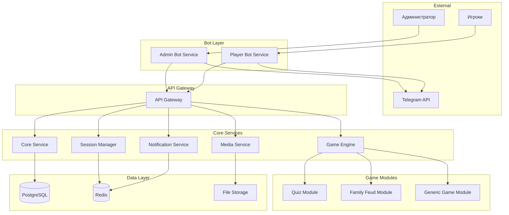
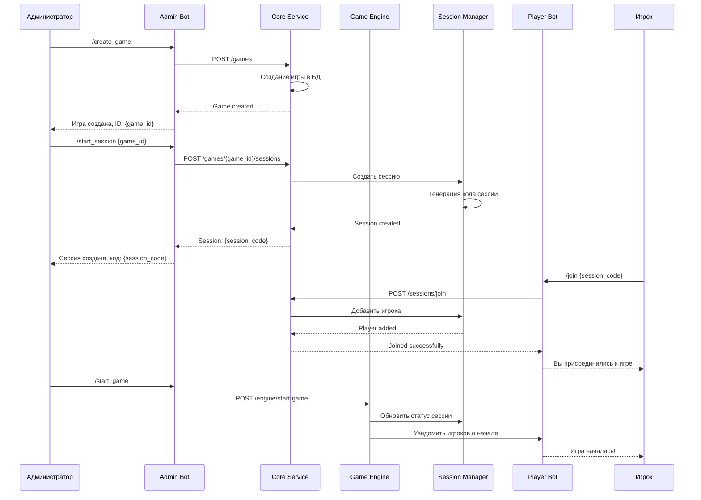
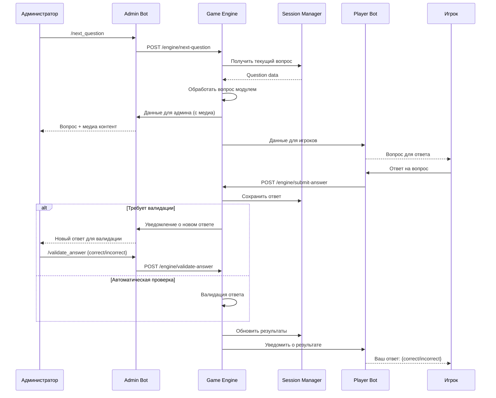

# Архитектура системы телеграм-ботов для игр

## 1. Анализ требований

### Функциональные требования:
- **Управление играми**: Администратор создает игры и управляет процессом
- **Подключение игроков**: По QR-коду или коду игры
- **Типы вопросов**: 
  - Базовые с вариантами ответов
  - С медиа-контентом для администратора
  - С текстовыми ответами, требующими валидации
- **Результаты**: Отображение в конце игры
- **Очистка данных**: После игры, но сохранение материалов
- **Модульность**: Поддержка разных типов игр
- **Игровые паки**: Создание через JSON
- **Масштабирование**: Множественные сессии и игроки

### Нефункциональные требования:
- **Производительность**: Начальная нагрузка малая, но архитектура должна масштабироваться
- **Надежность**: Высокая доступность системы
- **Безопасность**: Изоляция игровых сессий
- **Развертывание**: Docker контейнеры
- **Технологии**: Python + FastAPI + PostgreSQL + Redis

## 2. Общая концепция архитектуры

### Принципы проектирования:
1. **Микросервисная архитектура** - разделение ответственности между сервисами
2. **Модульность игр** - плагинная система для разных типов игр
3. **Разделение ботов** - отдельные боты для администраторов и игроков
4. **Событийная архитектура** - асинхронная обработка игровых событий
5. **Горизонтальное масштабирование** - возможность добавления новых инстансов

### Основные компоненты:
- **Core Service** - основная логика системы
- **Admin Bot Service** - бот для администраторов
- **Player Bot Service** - бот для игроков
- **Game Engine** - движок игр с модульной системой
- **Session Manager** - управление игровыми сессиями
- **Media Service** - обработка медиа-контента
- **Notification Service** - система уведомлений

## 3. Компонентная архитектура



## 4. Детальное описание компонентов

### 4.1 Core Service
**Назначение**: Центральный сервис управления системой

**Ответственности**:
- Управление пользователями и ролями
- Создание и управление играми
- Аутентификация и авторизация
- Координация между сервисами

**API Endpoints**:
- `POST /games` - создание игры
- `GET /games/{game_id}` - получение информации об игре
- `POST /games/{game_id}/sessions` - создание игровой сессии
- `GET /users/{user_id}` - информация о пользователе

### 4.2 Admin Bot Service
**Назначение**: Telegram бот для администраторов

**Ответственности**:
- Интерфейс создания игр
- Управление игровым процессом
- Просмотр медиа-контента
- Валидация ответов игроков

**Основные команды**:
- `/create_game` - создание новой игры
- `/start_session` - запуск игровой сессии
- `/next_question` - переход к следующему вопросу
- `/validate_answer` - валидация ответа игрока

### 4.3 Player Bot Service
**Назначение**: Telegram бот для игроков

**Ответственности**:
- Подключение к игровым сессиям
- Отображение вопросов
- Прием ответов от игроков
- Показ результатов

**Основные команды**:
- `/join {code}` - подключение к игре по коду
- `/answer {text}` - отправка ответа
- `/results` - просмотр результатов

### 4.4 Game Engine
**Назначение**: Движок обработки игровой логики

**Ответственности**:
- Загрузка игровых модулей
- Обработка игровых событий
- Подсчет очков
- Управление состоянием игры

**Модульная система**:
```python
class GameModule:
    def process_question(self, question, session)
    def validate_answer(self, answer, question)
    def calculate_score(self, answers)
    def get_results(self, session)
```

### 4.5 Session Manager
**Назначение**: Управление игровыми сессиями

**Ответственности**:
- Создание и удаление сессий
- Управление состоянием сессий
- Кэширование активных данных
- Очистка завершенных сессий

**Структура сессии в Redis**:
```json
{
  "session_id": "uuid",
  "game_id": "game_uuid",
  "admin_id": "telegram_user_id",
  "players": ["player_id1", "player_id2"],
  "current_question": 1,
  "status": "active",
  "created_at": "timestamp",
  "answers": {}
}
```

### 4.6 Media Service
**Назначение**: Обработка медиа-контента

**Ответственности**:
- Загрузка и хранение медиа-файлов
- Генерация превью
- Управление доступом к файлам
- Оптимизация контента

### 4.7 Notification Service
**Назначение**: Система уведомлений

**Ответственности**:
- Отправка уведомлений игрокам
- Уведомления администраторам
- Управление очередью сообщений
- Retry механизм для неудачных отправок

## 5. Схема базы данных

```sql
-- Пользователи системы
CREATE TABLE users (
    id UUID PRIMARY KEY DEFAULT gen_random_uuid(),
    telegram_id BIGINT UNIQUE NOT NULL,
    username VARCHAR(255),
    first_name VARCHAR(255),
    last_name VARCHAR(255),
    role VARCHAR(50) DEFAULT 'player',
    created_at TIMESTAMP DEFAULT CURRENT_TIMESTAMP,
    updated_at TIMESTAMP DEFAULT CURRENT_TIMESTAMP
);

-- Игры (шаблоны)
CREATE TABLE games (
    id UUID PRIMARY KEY DEFAULT gen_random_uuid(),
    title VARCHAR(255) NOT NULL,
    description TEXT,
    game_type VARCHAR(100) NOT NULL,
    config JSONB NOT NULL,
    created_by UUID REFERENCES users(id),
    created_at TIMESTAMP DEFAULT CURRENT_TIMESTAMP,
    updated_at TIMESTAMP DEFAULT CURRENT_TIMESTAMP
);

-- Вопросы игр
CREATE TABLE questions (
    id UUID PRIMARY KEY DEFAULT gen_random_uuid(),
    game_id UUID REFERENCES games(id) ON DELETE CASCADE,
    order_index INTEGER NOT NULL,
    question_type VARCHAR(50) NOT NULL,
    content JSONB NOT NULL,
    media_url VARCHAR(500),
    correct_answers JSONB,
    points INTEGER DEFAULT 1,
    time_limit INTEGER DEFAULT 30
);

-- Игровые сессии
CREATE TABLE game_sessions (
    id UUID PRIMARY KEY DEFAULT gen_random_uuid(),
    game_id UUID REFERENCES games(id),
    admin_id UUID REFERENCES users(id),
    session_code VARCHAR(10) UNIQUE NOT NULL,
    status VARCHAR(50) DEFAULT 'waiting',
    current_question_id UUID REFERENCES questions(id),
    started_at TIMESTAMP,
    ended_at TIMESTAMP,
    created_at TIMESTAMP DEFAULT CURRENT_TIMESTAMP
);

-- Участники сессий
CREATE TABLE session_participants (
    id UUID PRIMARY KEY DEFAULT gen_random_uuid(),
    session_id UUID REFERENCES game_sessions(id) ON DELETE CASCADE,
    user_id UUID REFERENCES users(id),
    joined_at TIMESTAMP DEFAULT CURRENT_TIMESTAMP,
    score INTEGER DEFAULT 0
);

-- Ответы игроков
CREATE TABLE player_answers (
    id UUID PRIMARY KEY DEFAULT gen_random_uuid(),
    session_id UUID REFERENCES game_sessions(id) ON DELETE CASCADE,
    question_id UUID REFERENCES questions(id),
    user_id UUID REFERENCES users(id),
    answer_text TEXT,
    is_correct BOOLEAN,
    points_earned INTEGER DEFAULT 0,
    answered_at TIMESTAMP DEFAULT CURRENT_TIMESTAMP,
    validated_by UUID REFERENCES users(id),
    validated_at TIMESTAMP
);

-- Медиа-файлы
CREATE TABLE media_files (
    id UUID PRIMARY KEY DEFAULT gen_random_uuid(),
    filename VARCHAR(255) NOT NULL,
    original_name VARCHAR(255),
    file_path VARCHAR(500) NOT NULL,
    file_size BIGINT,
    mime_type VARCHAR(100),
    uploaded_by UUID REFERENCES users(id),
    created_at TIMESTAMP DEFAULT CURRENT_TIMESTAMP
);

-- Индексы для производительности
CREATE INDEX idx_users_telegram_id ON users(telegram_id);
CREATE INDEX idx_games_type ON games(game_type);
CREATE INDEX idx_questions_game_id ON questions(game_id);
CREATE INDEX idx_sessions_code ON game_sessions(session_code);
CREATE INDEX idx_sessions_status ON game_sessions(status);
CREATE INDEX idx_participants_session ON session_participants(session_id);
CREATE INDEX idx_answers_session_question ON player_answers(session_id, question_id);
```

## 6. API между компонентами

### 6.1 Core Service API

```yaml
openapi: 3.0.0
info:
  title: Game System Core API
  version: 1.0.0

paths:
  /games:
    post:
      summary: Создать игру
      requestBody:
        content:
          application/json:
            schema:
              type: object
              properties:
                title: string
                description: string
                game_type: string
                config: object
      responses:
        201:
          description: Игра создана
          content:
            application/json:
              schema:
                $ref: '#/components/schemas/Game'

  /games/{gameId}/sessions:
    post:
      summary: Создать игровую сессию
      parameters:
        - name: gameId
          in: path
          required: true
          schema:
            type: string
      responses:
        201:
          description: Сессия создана
          content:
            application/json:
              schema:
                $ref: '#/components/schemas/GameSession'

  /sessions/{sessionId}/join:
    post:
      summary: Присоединиться к сессии
      parameters:
        - name: sessionId
          in: path
          required: true
          schema:
            type: string
      requestBody:
        content:
          application/json:
            schema:
              type: object
              properties:
                user_id: string
      responses:
        200:
          description: Успешно присоединился

  /sessions/{sessionId}/answer:
    post:
      summary: Отправить ответ
      parameters:
        - name: sessionId
          in: path
          required: true
          schema:
            type: string
      requestBody:
        content:
          application/json:
            schema:
              type: object
              properties:
                user_id: string
                question_id: string
                answer: string
      responses:
        200:
          description: Ответ принят

components:
  schemas:
    Game:
      type: object
      properties:
        id: string
        title: string
        description: string
        game_type: string
        config: object
        created_at: string
    
    GameSession:
      type: object
      properties:
        id: string
        game_id: string
        session_code: string
        status: string
        created_at: string
```

### 6.2 Game Engine API

```yaml
paths:
  /engine/process-question:
    post:
      summary: Обработать вопрос
      requestBody:
        content:
          application/json:
            schema:
              type: object
              properties:
                session_id: string
                question_id: string
                game_type: string
      responses:
        200:
          description: Вопрос обработан

  /engine/validate-answer:
    post:
      summary: Валидировать ответ
      requestBody:
        content:
          application/json:
            schema:
              type: object
              properties:
                answer_id: string
                is_correct: boolean
                points: integer
      responses:
        200:
          description: Ответ валидирован

  /engine/calculate-results:
    post:
      summary: Подсчитать результаты
      requestBody:
        content:
          application/json:
            schema:
              type: object
              properties:
                session_id: string
      responses:
        200:
          description: Результаты подсчитаны
          content:
            application/json:
              schema:
                type: object
                properties:
                  results: array
```

## 7. Модульная система для игр

### 7.1 Базовый интерфейс игрового модуля

```python
from abc import ABC, abstractmethod
from typing import Dict, Any, List
from dataclasses import dataclass

@dataclass
class Question:
    id: str
    content: Dict[str, Any]
    question_type: str
    correct_answers: List[str]
    points: int
    time_limit: int

@dataclass
class Answer:
    user_id: str
    question_id: str
    content: str
    timestamp: float

@dataclass
class GameResult:
    user_id: str
    score: int
    correct_answers: int
    total_questions: int

class GameModule(ABC):
    """Базовый класс для игровых модулей"""
    
    @abstractmethod
    def get_game_type(self) -> str:
        """Возвращает тип игры"""
        pass
    
    @abstractmethod
    def validate_game_config(self, config: Dict[str, Any]) -> bool:
        """Валидирует конфигурацию игры"""
        pass
    
    @abstractmethod
    def process_question(self, question: Question, session_data: Dict[str, Any]) -> Dict[str, Any]:
        """Обрабатывает вопрос для отображения игрокам"""
        pass
    
    @abstractmethod
    def validate_answer(self, answer: Answer, question: Question) -> tuple[bool, int]:
        """Валидирует ответ игрока. Возвращает (правильность, очки)"""
        pass
    
    @abstractmethod
    def calculate_final_results(self, session_data: Dict[str, Any]) -> List[GameResult]:
        """Подсчитывает финальные результаты игры"""
        pass
    
    @abstractmethod
    def get_question_for_admin(self, question: Question) -> Dict[str, Any]:
        """Возвращает данные вопроса для администратора (включая медиа)"""
        pass
```

### 7.2 Модуль викторины

```python
class QuizModule(GameModule):
    def get_game_type(self) -> str:
        return "quiz"
    
    def validate_game_config(self, config: Dict[str, Any]) -> bool:
        required_fields = ["questions", "time_per_question", "scoring_type"]
        return all(field in config for field in required_fields)
    
    def process_question(self, question: Question, session_data: Dict[str, Any]) -> Dict[str, Any]:
        if question.question_type == "multiple_choice":
            return {
                "question_text": question.content["text"],
                "options": question.content["options"],
                "question_id": question.id,
                "time_limit": question.time_limit
            }
        elif question.question_type == "text_input":
            return {
                "question_text": question.content["text"],
                "question_id": question.id,
                "time_limit": question.time_limit,
                "requires_validation": True
            }
    
    def validate_answer(self, answer: Answer, question: Question) -> tuple[bool, int]:
        if question.question_type == "multiple_choice":
            is_correct = answer.content in question.correct_answers
            return is_correct, question.points if is_correct else 0
        elif question.question_type == "text_input":
            # Требует ручной валидации администратором
            return False, 0  # Будет обновлено после валидации
    
    def calculate_final_results(self, session_data: Dict[str, Any]) -> List[GameResult]:
        results = []
        for user_id, user_data in session_data["participants"].items():
            result = GameResult(
                user_id=user_id,
                score=user_data["total_score"],
                correct_answers=user_data["correct_count"],
                total_questions=len(session_data["questions"])
            )
            results.append(result)
        return sorted(results, key=lambda x: x.score, reverse=True)
    
    def get_question_for_admin(self, question: Question) -> Dict[str, Any]:
        admin_data = {
            "question_text": question.content["text"],
            "question_id": question.id,
            "correct_answers": question.correct_answers,
            "points": question.points
        }
        
        if "media_url" in question.content:
            admin_data["media_url"] = question.content["media_url"]
            admin_data["media_type"] = question.content.get("media_type", "image")
        
        return admin_data
```

### 7.3 Модуль "100 к одному"

```python
class FamilyFeudModule(GameModule):
    def get_game_type(self) -> str:
        return "family_feud"
    
    def validate_game_config(self, config: Dict[str, Any]) -> bool:
        required_fields = ["questions", "team_mode", "rounds"]
        return all(field in config for field in required_fields)
    
    def process_question(self, question: Question, session_data: Dict[str, Any]) -> Dict[str, Any]:
        return {
            "question_text": question.content["text"],
            "question_id": question.id,
            "revealed_answers": session_data.get("revealed_answers", []),
            "team_scores": session_data.get("team_scores", {}),
            "current_team": session_data.get("current_team")
        }
    
    def validate_answer(self, answer: Answer, question: Question) -> tuple[bool, int]:
        answers_data = question.content["answers"]
        for answer_data in answers_data:
            if self._is_similar_answer(answer.content, answer_data["text"]):
                return True, answer_data["points"]
        return False, 0
    
    def _is_similar_answer(self, user_answer: str, correct_answer: str) -> bool:
        # Логика сравнения ответов с учетом синонимов и опечаток
        user_clean = user_answer.lower().strip()
        correct_clean = correct_answer.lower().strip()
        return user_clean == correct_clean  # Упрощенная версия
    
    def calculate_final_results(self, session_data: Dict[str, Any]) -> List[GameResult]:
        if session_data.get("team_mode"):
            # Командные результаты
            team_results = []
            for team_id, team_data in session_data["teams"].items():
                result = GameResult(
                    user_id=team_id,
                    score=team_data["total_score"],
                    correct_answers=team_data["correct_count"],
                    total_questions=len(session_data["questions"])
                )
                team_results.append(result)
            return sorted(team_results, key=lambda x: x.score, reverse=True)
        else:
            # Индивидуальные результаты
            return super().calculate_final_results(session_data)
```

## 8. Схема взаимодействия ботов

### 8.1 Поток создания и запуска игры



### 8.2 Поток обработки вопроса



### 8.3 Архитектура ботов

```python
# Admin Bot Service
class AdminBotService:
    def __init__(self, token: str, core_api_url: str):
        self.bot = Bot(token=token)
        self.dp = Dispatcher()
        self.core_api = CoreAPIClient(core_api_url)
        self.setup_handlers()
    
    def setup_handlers(self):
        self.dp.message.register(self.create_game_handler, Command("create_game"))
        self.dp.message.register(self.start_session_handler, Command("start_session"))
        self.dp.message.register(self.next_question_handler, Command("next_question"))
        self.dp.callback_query.register(self.validate_answer_handler, F.data.startswith("validate_"))
    
    async def create_game_handler(self, message: Message):
        # Логика создания игры
        pass
    
    async def start_session_handler(self, message: Message):
        # Логика запуска сессии
        pass

# Player Bot Service
class PlayerBotService:
    def __init__(self, token: str, core_api_url: str):
        self.bot = Bot(token=token)
        self.dp = Dispatcher()
        self.core_api = CoreAPIClient(core_api_url)
        self.setup_handlers()
    
    def setup_handlers(self):
        self.dp.message.register(self.join_game_handler, Command("join"))
        self.dp.message.register(self.answer_handler, F.text)
        self.dp.callback_query.register(self.option_handler, F.data.startswith("answer_"))
    
    async def join_game_handler(self, message: Message):
        # Логика присоединения к игре
        pass
    
    async def answer_handler(self, message: Message):
        # Логика обработки ответа
        pass
```

## 9. Структура JSON для игровых паков

### 9.1 Схема игрового пака

```json
{
  "game_pack": {
    "meta": {
      "title": "Викторина по истории",
      "description": "Вопросы по истории России",
      "version": "1.0.0",
      "author": "Admin",
      "game_type": "quiz",
      "created_at": "2024-01-15T10:00:00Z"
    },
    "config": {
      "time_per_question": 30,
      "scoring_type": "standard",
      "allow_skip": false,
      "show_correct_answer": true,
      "randomize_questions": false,
      "randomize_options": true
    },
    "questions": [
      {
        "id": "q1",
        "order": 1,
        "type": "multiple_choice",
        "content": {
          "text": "В каком году была основана Москва?",
          "options": [
            "1147",
            "1156",
            "1162",
            "1174"
          ]
        },
        "correct_answers": ["1147"],
        "points": 10,
        "time_limit": 30,
        "explanation": "Москва была основана в 1147 году князем Юрием Долгоруким."
      },
      {
        "id": "q2",
        "order": 2,
        "type": "text_input",
        "content": {
          "text": "Назовите первого императора России"
        },
        "correct_answers": ["Петр I", "Петр Первый", "Петр Великий"],
        "points": 15,
        "time_limit": 45,
        "requires_validation": true,
        "validation_hints": [
          "Принимаются различные варианты написания имени",
          "Учитывается регистр"
        ]
      },
      {
        "id": "q3",
        "order": 3,
        "type": "media_question",
        "content": {
          "text": "Что изображено на этой картине?",
          "media_url": "/media/painting_1.jpg",
          "media_type": "image",
          "admin_only_media": true
        },
        "correct_answers": ["Бородинская битва"],
        "points": 20,
        "time_limit": 60,
        "requires_validation": true
      }
    ],
    "media": [
      {
        "id": "media_1",
        "filename": "painting_1.jpg",
        "type": "image",
        "description": "Картина Бородинской битвы",
        "admin_only": true
      }
    ]
  }
}
```

### 9.2 Схема для игры "100 к одному"

```json
{
  "game_pack": {
    "meta": {
      "title": "100 к одному - Семья",
      "description": "Вопросы на семейную тематику",
      "version": "1.0.0",
      "author": "Admin",
      "game_type": "family_feud",
      "created_at": "2024-01-15T10:00:00Z"
    },
    "config": {
      "team_mode": true,
      "max_teams": 2,
      "rounds": 3,
      "strikes_limit": 3,
      "double_points_round": 2,
      "triple_points_round": 3
    },
    "questions": [
      {
        "id": "ff1",
        "order": 1,
        "type": "survey_question",
        "content": {
          "text": "Назовите самое популярное домашнее животное",
          "survey_size": 100,
          "answers": [
            {"text": "Кошка", "points": 45, "rank": 1},
            {"text": "Собака", "points": 38, "rank": 2},
            {"text": "Рыбка", "points": 8, "rank": 3},
            {"text": "