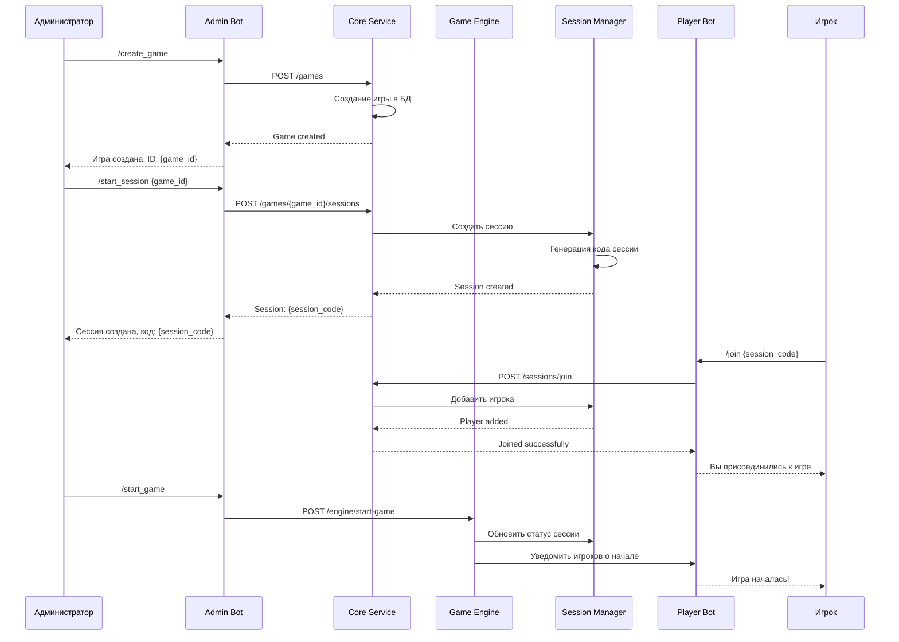
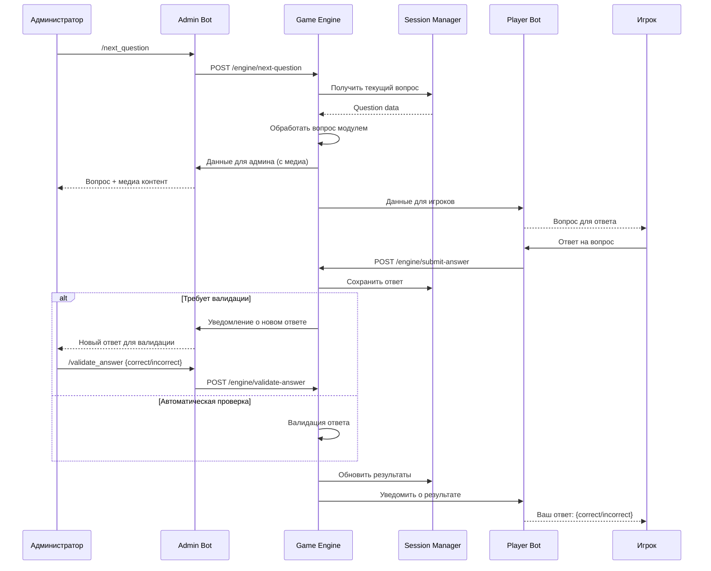

# Схемы взаимодействия ботов

## Поток создания и запуска игры



## Поток обработки вопроса



## Архитектура ботов

### Admin Bot Service

```python
class AdminBotService:
    def __init__(self, token: str, core_api_url: str):
        self.bot = Bot(token=token)
        self.dp = Dispatcher()
        self.core_api = CoreAPIClient(core_api_url)
        self.setup_handlers()
    
    def setup_handlers(self):
        self.dp.message.register(self.create_game_handler, Command("create_game"))
        self.dp.message.register(self.start_session_handler, Command("start_session"))
        self.dp.message.register(self.next_question_handler, Command("next_question"))
        self.dp.callback_query.register(self.validate_answer_handler, F.data.startswith("validate_"))
    
    async def create_game_handler(self, message: Message):
        """Обработчик создания игры"""
        user_id = message.from_user.id
        
        # Проверка прав администратора
        if not await self.core_api.is_admin(user_id):
            await message.answer("У вас нет прав администратора")
            return
        
        # Запрос данных игры
        await message.answer(
            "Создание новой игры. Выберите тип:",
            reply_markup=self.get_game_type_keyboard()
        )
    
    async def start_session_handler(self, message: Message):
        """Обработчик запуска сессии"""
        args = message.text.split()[1:]
        if not args:
            await message.answer("Укажите ID игры: /start_session <game_id>")
            return
        
        game_id = args[0]
        try:
            session = await self.core_api.create_session(game_id, message.from_user.id)
            await message.answer(
                f"Сессия создана!\n"
                f"Код для подключения: `{session['session_code']}`\n"
                f"QR-код: {self.generate_qr_url(session['session_code'])}",
                parse_mode="Markdown"
            )
        except Exception as e:
            await message.answer(f"Ошибка создания сессии: {e}")
    
    async def next_question_handler(self, message: Message):
        """Обработчик перехода к следующему вопросу"""
        user_id = message.from_user.id
        
        # Получение активной сессии администратора
        session = await self.core_api.get_admin_active_session(user_id)
        if not session:
            await message.answer("У вас нет активной сессии")
            return
        
        try:
            question_data = await self.core_api.next_question(session['id'])
            await self.send_question_to_admin(message, question_data)
        except Exception as e:
            await message.answer(f"Ошибка: {e}")
    
    async def send_question_to_admin(self, message: Message, question_data: dict):
        """Отправка вопроса администратору"""
        text = f"Вопрос {question_data['order']}: {question_data['text']}"
        
        if question_data.get('media_url'):
            if question_data['media_type'] == 'image':
                await message.answer_photo(
                    photo=question_data['media_url'],
                    caption=text
                )
            elif question_data['media_type'] == 'video':
                await message.answer_video(
                    video=question_data['media_url'],
                    caption=text
                )
        else:
            await message.answer(text)
        
        # Показать правильные ответы
        if question_data.get('correct_answers'):
            answers_text = "Правильные ответы:\n" + "\n".join(
                f"• {answer}" for answer in question_data['correct_answers']
            )
            await message.answer(answers_text)
    
    def get_game_type_keyboard(self):
        """Клавиатура выбора типа игры"""
        keyboard = InlineKeyboardBuilder()
        keyboard.button(text="Викторина", callback_data="game_type:quiz")
        keyboard.button(text="100 к одному", callback_data="game_type:family_feud")
        keyboard.adjust(1)
        return keyboard.as_markup()
```

### Player Bot Service

```python
class PlayerBotService:
    def __init__(self, token: str, core_api_url: str):
        self.bot = Bot(token=token)
        self.dp = Dispatcher()
        self.core_api = CoreAPIClient(core_api_url)
        self.setup_handlers()
    
    def setup_handlers(self):
        self.dp.message.register(self.start_handler, CommandStart())
        self.dp.message.register(self.join_game_handler, Command("join"))
        self.dp.message.register(self.answer_handler, F.text)
        self.dp.callback_query.register(self.option_handler, F.data.startswith("answer_"))
    
    async def start_handler(self, message: Message):
        """Обработчик команды /start"""
        await message.answer(
            "Добро пожаловать в игровую систему!\n\n"
            "Для подключения к игре используйте:\n"
            "/join <код_игры>\n\n"
            "Или отсканируйте QR-код от администратора игры."
        )
    
    async def join_game_handler(self, message: Message):
        """Обработчик присоединения к игре"""
        args = message.text.split()[1:]
        if not args:
            await message.answer("Укажите код игры: /join <код>")
            return
        
        session_code = args[0].upper()
        user_id = message.from_user.id
        
        try:
            # Регистрация пользователя
            await self.core_api.register_user(
                telegram_id=user_id,
                username=message.from_user.username,
                first_name=message.from_user.first_name,
                last_name=message.from_user.last_name
            )
            
            # Присоединение к сессии
            result = await self.core_api.join_session(session_code, user_id)
            
            await message.answer(
                f"Вы успешно присоединились к игре!\n"
                f"Игра: {result['game_title']}\n"
                f"Игроков в сессии: {result['players_count']}\n\n"
                "Ожидайте начала игры..."
            )
            
        except Exception as e:
            await message.answer(f"Ошибка присоединения: {e}")
    
    async def answer_handler(self, message: Message):
        """Обработчик текстовых ответов"""
        user_id = message.from_user.id
        
        # Проверка активной сессии пользователя
        session = await self.core_api.get_user_active_session(user_id)
        if not session:
            return  # Игнорируем сообщения вне игры
        
        # Проверка состояния игры
        if session['status'] != 'question_active':
            await message.answer("Сейчас нельзя отвечать на вопросы")
            return
        
        try:
            result = await self.core_api.submit_answer(
                session_id=session['id'],
                user_id=user_id,
                answer=message.text
            )
            
            if result['requires_validation']:
                await message.answer(
                    "Ваш ответ отправлен на проверку администратору. "
                    "Результат будет объявлен позже."
                )
            else:
                status = "правильный" if result['is_correct'] else "неправильный"
                points = result.get('points_earned', 0)
                await message.answer(
                    f"Ваш ответ {status}!\n"
                    f"Получено очков: {points}"
                )
                
        except Exception as e:
            await message.answer(f"Ошибка отправки ответа: {e}")
    
    async def send_question_to_players(self, session_id: str, question_data: dict):
        """Отправка вопроса всем игрокам сессии"""
        players = await self.core_api.get_session_players(session_id)
        
        for player in players:
            try:
                if question_data['type'] == 'multiple_choice':
                    keyboard = self.create_options_keyboard(
                        question_data['options'],
                        question_data['question_id']
                    )
                    await self.bot.send_message(
                        chat_id=player['telegram_id'],
                        text=f"Вопрос: {question_data['text']}",
                        reply_markup=keyboard
                    )
                else:
                    await self.bot.send_message(
                        chat_id=player['telegram_id'],
                        text=f"Вопрос: {question_data['text']}\n\n"
                             f"Введите ваш ответ:"
                    )
            except Exception as e:
                logger.error(f"Failed to send question to player {player['id']}: {e}")
    
    def create_options_keyboard(self, options: list, question_id: str):
        """Создание клавиатуры с вариантами ответов"""
        keyboard = InlineKeyboardBuilder()
        for i, option in enumerate(options):
            keyboard.button(
                text=option,
                callback_data=f"answer_{question_id}_{i}_{option}"
            )
        keyboard.adjust(1)
        return keyboard.as_markup()
    
    async def option_handler(self, callback: CallbackQuery):
        """Обработчик выбора варианта ответа"""
        data_parts = callback.data.split('_', 3)
        if len(data_parts) != 4:
            return
        
        _, question_id, option_index, option_text = data_parts
        user_id = callback.from_user.id
        
        try:
            result = await self.core_api.submit_answer(
                question_id=question_id,
                user_id=user_id,
                answer=option_text
            )
            
            status = "правильный" if result['is_correct'] else "неправильный"
            points = result.get('points_earned', 0)
            
            await callback.message.edit_text(
                f"Вы выбрали: {option_text}\n"
                f"Ответ {status}!\n"
                f"Получено очков: {points}"
            )
            
        except Exception as e:
            await callback.answer(f"Ошибка: {e}", show_alert=True)
```

## Уведомления и события

### Notification Service

```python
class NotificationService:
    def __init__(self, redis_url: str, admin_bot_url: str, player_bot_url: str):
        self.redis = aioredis.from_url(redis_url)
        self.admin_bot_client = AdminBotClient(admin_bot_url)
        self.player_bot_client = PlayerBotClient(player_bot_url)
    
    async def notify_game_started(self, session_id: str):
        """Уведомление о начале игры"""
        session = await self.get_session_data(session_id)
        players = await self.get_session_players(session_id)
        
        # Уведомление игрокам
        for player in players:
            await self.player_bot_client.send_message(
                player['telegram_id'],
                f"Игра '{session['game_title']}' началась! Приготовьтесь к первому вопросу."
            )
    
    async def notify_question_sent(self, session_id: str, question_data: dict):
        """Уведомление об отправке вопроса"""
        # Отправка вопроса игрокам через Player Bot
        await self.player_bot_client.send_question_to_players(session_id, question_data)
        
        # Уведомление администратору
        admin_id = await self.get_session_admin(session_id)
        await self.admin_bot_client.send_message(
            admin_id,
            f"Вопрос отправлен игрокам. Ожидание ответов..."
        )
    
    async def notify_answer_validation_needed(self, session_id: str, answer_data: dict):
        """Уведомление о необходимости валидации ответа"""
        admin_id = await self.get_session_admin(session_id)
        
        keyboard = InlineKeyboardBuilder()
        keyboard.button(
            text="✅ Правильно",
            callback_data=f"validate_{answer_data['id']}_correct"
        )
        keyboard.button(
            text="❌ Неправильно",
            callback_data=f"validate_{answer_data['id']}_incorrect"
        )
        keyboard.adjust(2)
        
        await self.admin_bot_client.send_message(
            admin_id,
            f"Новый ответ для валидации:\n\n"
            f"Игрок: {answer_data['player_name']}\n"
            f"Вопрос: {answer_data['question_text']}\n"
            f"Ответ: {answer_data['answer_text']}",
            reply_markup=keyboard.as_markup()
        )
    
    async def notify_game_finished(self, session_id: str, results: list):
        """Уведомление о завершении игры"""
        session = await self.get_session_data(session_id)
        
        # Формирование таблицы результатов
        results_text = "🏆 Результаты игры:\n\n"
        for i, result in enumerate(results[:10], 1):
            medal = "🥇" if i == 1 else "🥈" if i == 2 else "🥉" if i == 3 else f"{i}."
            results_text += f"{medal} {result['player_name']} - {result['score']} очков\n"
        
        # Отправка результатов всем участникам
        players = await self.get_session_players(session_id)
        for player in players:
            await self.player_bot_client.send_message(
                player['telegram_id'],
                f"Игра '{session['game_title']}' завершена!\n\n{results_text}"
            )
        
        # Уведомление администратору
        admin_id = await self.get_session_admin(session_id)
        await self.admin_bot_client.send_message(
            admin_id,
            f"Игра завершена!\n\n{results_text}\n"
            f"Всего участников: {len(players)}"
        )
```

## Обработка ошибок и восстановление

### Error Recovery System

```python
class ErrorRecoverySystem:
    def __init__(self, core_api: CoreAPIClient, redis: aioredis.Redis):
        self.core_api = core_api
        self.redis = redis
    
    async def handle_bot_disconnection(self, bot_type: str):
        """Обработка отключения бота"""
        logger.warning(f"{bot_type} bot disconnected")
        
        # Сохранение состояния активных сессий
        active_sessions = await self.core_api.get_active_sessions()
        for session in active_sessions:
            await self.redis.setex(
                f"session_backup:{session['id']}",
                3600,  # 1 час
                json.dumps(session)
            )
        
        # Попытка переподключения
        await self.attempt_reconnection(bot_type)
    
    async def handle_session_corruption(self, session_id: str):
        """Обработка повреждения данных сессии"""
        logger.error(f"Session {session_id} data corrupted")
        
        # Попытка восстановления из бэкапа
        backup_data = await self.redis.get(f"session_backup:{session_id}")
        if backup_data:
            session_data = json.loads(backup_data)
            await self.core_api.restore_session(session_id, session_data)
            logger.info(f"Session {session_id} restored from backup")
        else:
            # Уведомление участников об ошибке
            await self.notify_session_error(session_id)
    
    async def handle_database_connection_loss(self):
        """Обработка потери соединения с БД"""
        logger.critical("Database connection lost")
        
        # Переключение на режим только чтения из Redis
        await self.redis.set("db_readonly_mode", "true", ex=300)
        
        # Уведомление администраторов
        await self.notify_system_administrators(
            "Database connection lost. System in read-only mode."
        )