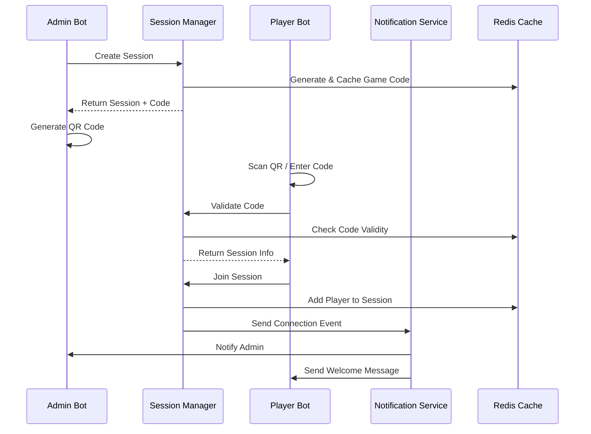

# Player Connection System Documentation

## Overview

This document describes the comprehensive player connection system implemented for the Telegram game platform. The system supports multiple connection methods including QR codes, deep links, and manual code entry, with full integration across all services.

## Architecture

### Core Components

1. **Session Manager Service** - Manages game codes and session connections
2. **Player Bot Service** - Handles player interactions and connections
3. **Admin Bot Service** - Provides QR code generation and management
4. **Notification Service** - Handles real-time notifications and events
5. **Shared Schemas** - Common data structures and validation

### Connection Flow



## Implementation Details

### 1. Shared Schemas (`shared/schemas/connection.py`)

**Key Features:**
- Comprehensive validation for game codes (4-10 alphanumeric characters)
- Connection method tracking (QR code, deep link, manual entry)
- Error code standardization with user-friendly messages
- Support for bulk operations and analytics

**Main Schemas:**
- `ConnectionRequest` - Player connection attempts
- `ConnectionResponse` - Connection results with detailed feedback
- `GameCodeCreate/Response` - Code generation and management
- `SessionInfoResponse` - Session details for players
- `ConnectionValidation` - Code validation with security checks

### 2. Code Generation Service (`services/session-manager/app/services/code_generator.py`)

**Features:**
- **Smart Code Generation**: Readable codes using consonant-vowel-number patterns
- **Collision Avoidance**: Unique code generation with fallback mechanisms
- **Expiration Management**: Configurable TTL with automatic cleanup
- **Usage Tracking**: Monitor code usage and prevent abuse
- **Security**: Exclude offensive patterns and implement rate limiting

**Code Types:**
- **Readable Codes**: BANE23, CORE45 (easier for manual entry)
- **Alphanumeric**: ABC123, XYZ789 (maximum entropy)
- **UUID-based**: Fallback for high collision scenarios

### 3. Session Manager API (`services/session-manager/app/api/sessions.py`)

**Endpoints:**
- `POST /sessions/{session_id}/join` - Join session with game code
- `GET /sessions/by-code/{game_code}` - Get session info by code
- `POST /sessions/{session_id}/generate-code` - Generate new game code
- `DELETE /sessions/{session_id}/codes/{code}` - Deactivate code
- `POST /sessions/validate-code` - Validate code without joining

**Security Features:**
- Request rate limiting and IP tracking
- Duplicate connection prevention
- Session capacity enforcement
- Late join policy validation

### 4. Player Bot Connection Handlers (`services/player-bot/app/handlers/connection_handlers.py`)

**Connection Methods:**
1. **Deep Links**: `https://t.me/player_bot?start=GAME_CODE`
2. **QR Code Scanning**: Camera → Link → Automatic connection
3. **Manual Entry**: Interactive code input with validation
4. **Quick Join**: Direct code recognition in chat

**Features:**
- **Enhanced Start Handler**: Automatic deep link processing
- **Connection Validation**: Real-time code verification
- **Error Handling**: User-friendly error messages with retry options
- **State Management**: FSM for connection flow tracking
- **Reconnection Support**: Handle disconnections gracefully

### 5. Admin Bot QR Handlers (`services/admin-bot/app/handlers/qr_handlers.py`)

**QR Code Features:**
- **Multiple Formats**: Simple QR or QR with embedded text
- **Customizable Sizes**: 200x200 to 500x500 pixels
- **Share Options**: Copy code, share link, generate QR
- **Code Management**: View active codes, usage statistics
- **Batch Operations**: Create multiple codes, bulk deactivation

**QR Code Content:**
```
https://t.me/player_bot?start=GAME_CODE

Additional text overlay:
- Game title
- Game code
- Instructions
```

### 6. Notification Service Integration

**Event Types:**
- `player_joined` - New player connections
- `player_left` - Player disconnections
- `connection_failed` - Failed connection attempts
- `game_started` - Session start notifications
- `question_started` - New question alerts

**Notification Channels:**
- **Telegram**: Direct bot messages
- **WebSocket**: Real-time web updates
- **Email**: Important alerts (optional)
- **Push**: Mobile notifications (optional)

### 7. Redis Caching Strategy

**Cached Data:**
- **Game Codes**: `game_code:{CODE}` - Code metadata and validation
- **Session Mappings**: `session_codes:{SESSION_ID}` - Session → codes mapping
- **Usage Logs**: `code_usage_log:{CODE}` - Usage tracking and analytics
- **Active Sessions**: `session:{SESSION_ID}` - Real-time session data

**TTL Management:**
- Game codes: Configurable (default 1 hour)
- Session data: 24 hours
- Usage logs: 7 days
- Automatic cleanup of expired entries

## Connection Security

### Validation Layers

1. **Format Validation**: Regex pattern matching
2. **Existence Check**: Redis lookup
3. **Expiration Validation**: TTL verification
4. **Usage Limits**: Max uses enforcement
5. **Rate Limiting**: Per-user connection attempts
6. **Duplicate Prevention**: Active session checking

### Security Measures

- **Code Entropy**: Sufficient randomness to prevent guessing
- **Pattern Exclusion**: Block offensive or confusing patterns
- **IP Tracking**: Monitor connection sources
- **Abuse Detection**: Identify suspicious patterns
- **Session Isolation**: Prevent cross-session interference

## Error Handling

### Error Codes and Messages

| Code | User Message | Admin Action |
|------|-------------|--------------|
| `INVALID_CODE` | "Неверный код игры" | Check code format |
| `CODE_EXPIRED` | "Код игры истек" | Generate new code |
| `SESSION_FULL` | "Игра переполнена" | Increase capacity |
| `ALREADY_CONNECTED` | "Вы уже в игре" | Check user status |
| `LATE_JOIN_DISABLED` | "Присоединение отключено" | Enable late join |

### Recovery Mechanisms

- **Automatic Retry**: For transient failures
- **Alternative Methods**: Suggest different connection options
- **Admin Notification**: Alert admins to persistent issues
- **Graceful Degradation**: Fallback to basic functionality

## Usage Examples

### 1. Admin Creates Game and Generates QR

```python
# Admin bot creates session
session = await api_client.create_session({
    "title": "Quiz Night",
    "max_players": 20,
    "allow_late_join": True
})

# Generate QR code
qr_data = await qr_manager.generate_session_qr(
    session_id=session.id,
    game_code=session.session_code,
    game_title=session.title
)

# Send QR to admin
await bot.send_photo(
    chat_id=admin_chat_id,
    photo=qr_data["qr_data"],
    caption=f"QR-код для игры: {session.title}"
)
```

### 2. Player Connects via Deep Link

```python
# Player clicks QR code link: https://t.me/player_bot?start=ABC123
@router.message(CommandStart())
async def start_handler(message: Message, state: FSMContext):
    args = message.text.split()[1:]
    if args:
        game_code = args[0]
        
        # Validate code
        validation = await api_client.validate_code(game_code)
        if validation.valid and validation.can_join:
            # Show confirmation
            await show_join_confirmation(message, game_code, validation.session_info)
        else:
            await message.answer(f"❌ {validation.error_message}")
```

### 3. Connection Validation and Joining

```python
# Player confirms connection
@router.callback_query(F.data.startswith("confirm_join:"))
async def confirm_join(callback: CallbackQuery, state: FSMContext):
    game_code = callback.data.split(":", 1)[1]
    
    # Attempt connection
    result = await api_client.join_session_by_code(
        game_code=game_code,
        user_id=callback.from_user.id,
        display_name=callback.from_user.first_name
    )
    
    if result.success:
        await callback.message.edit_text(
            f"✅ Подключение успешно!\n"
            f"Игроков в сессии: {result.total_players}"
        )
    else:
        await callback.message.edit_text(f"❌ {result.error_message}")
```

## Monitoring and Analytics

### Key Metrics

- **Connection Success Rate**: Successful vs failed attempts
- **Connection Methods**: QR vs manual vs deep link usage
- **Code Usage**: Most/least used codes
- **Session Capacity**: Average players per session
- **Error Frequency**: Most common error types

### Logging

All connection events are logged with:
- Timestamp and user ID
- Connection method and session ID
- Success/failure status
- Error details (if applicable)
- IP address and user agent

### Health Checks

- **Redis Connectivity**: Connection pool status
- **Code Generation**: Service availability
- **Notification Delivery**: Success rates
- **WebSocket Connections**: Active connection count

## Configuration

### Environment Variables

```bash
# Session Manager
REDIS_URL=redis://localhost:6379
SESSION_EXPIRE_SECONDS=86400
CODE_DEFAULT_LENGTH=6
CODE_DEFAULT_EXPIRY_MINUTES=60

# Player Bot
PLAYER_BOT_USERNAME=your_player_bot
WEBHOOK_URL=https://your-domain.com/webhook

# Admin Bot
ADMIN_BOT_TOKEN=your_admin_bot_token
QR_DEFAULT_SIZE=300

# Notification Service
NOTIFICATION_WORKERS=3
ADMIN_USER_IDS=["admin1", "admin2"]
```

### Customization Options

- **Code Length**: 4-10 characters
- **Code Style**: Readable vs alphanumeric
- **Expiration Time**: 5 minutes to 24 hours
- **Usage Limits**: 1 to unlimited uses
- **QR Size**: 100x100 to 1000x1000 pixels
- **Notification Channels**: Telegram, WebSocket, Email, Push

## Deployment Considerations

### Scaling

- **Horizontal Scaling**: Multiple bot instances with load balancing
- **Redis Clustering**: For high-availability caching
- **Database Sharding**: For large user bases
- **CDN Integration**: For QR code image delivery

### Performance

- **Connection Pooling**: Efficient database connections
- **Caching Strategy**: Multi-layer caching (Redis + in-memory)
- **Async Processing**: Non-blocking I/O operations
- **Batch Operations**: Bulk notifications and updates

### Security

- **Rate Limiting**: Per-user and per-IP limits
- **Input Validation**: Comprehensive sanitization
- **Access Control**: Role-based permissions
- **Audit Logging**: Complete activity tracking

## Future Enhancements

### Planned Features

1. **Advanced QR Codes**: Custom branding and styling
2. **Social Sharing**: Direct sharing to social platforms
3. **Analytics Dashboard**: Real-time connection metrics
4. **Mobile App Integration**: Native app deep links
5. **Multi-language Support**: Localized error messages
6. **Advanced Security**: 2FA and device verification

### API Extensions

- **Webhook Support**: External system integration
- **GraphQL API**: Flexible data querying
- **Batch Operations**: Bulk user management
- **Real-time Subscriptions**: Live connection updates

## Troubleshooting

### Common Issues

1. **QR Code Not Working**
   - Check bot username configuration
   - Verify deep link format
   - Test with different QR readers

2. **Connection Timeouts**
   - Check Redis connectivity
   - Verify network configuration
   - Monitor service health

3. **Duplicate Connections**
   - Review session state management
   - Check user ID consistency
   - Verify cleanup processes

### Debug Tools

- **Connection Logs**: Detailed event tracking
- **Redis Monitoring**: Key inspection and TTL checking
- **Health Endpoints**: Service status verification
- **Test Commands**: Manual connection testing

## Conclusion

The player connection system provides a robust, secure, and user-friendly way for players to join games through multiple methods. The implementation includes comprehensive error handling, security measures, and monitoring capabilities to ensure reliable operation at scale.

The system is designed to be extensible and maintainable, with clear separation of concerns and well-defined interfaces between components. The use of Redis for caching and real-time features ensures good performance even under high load.