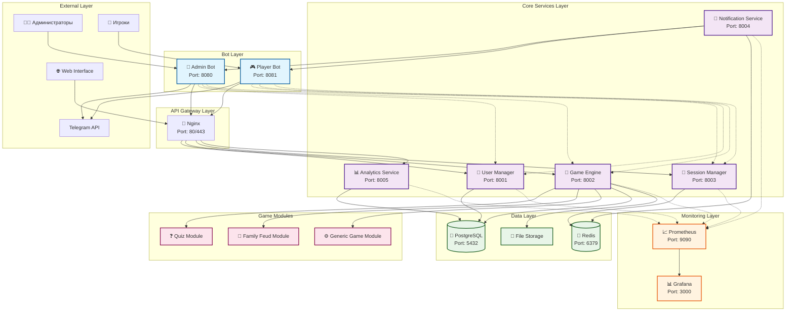
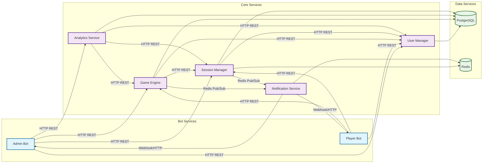
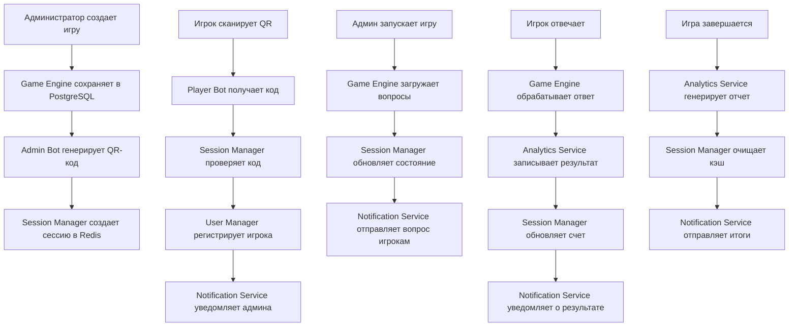
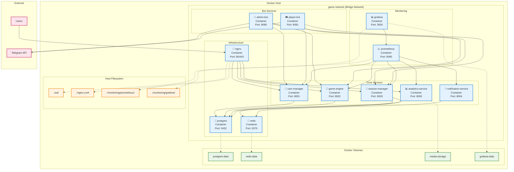
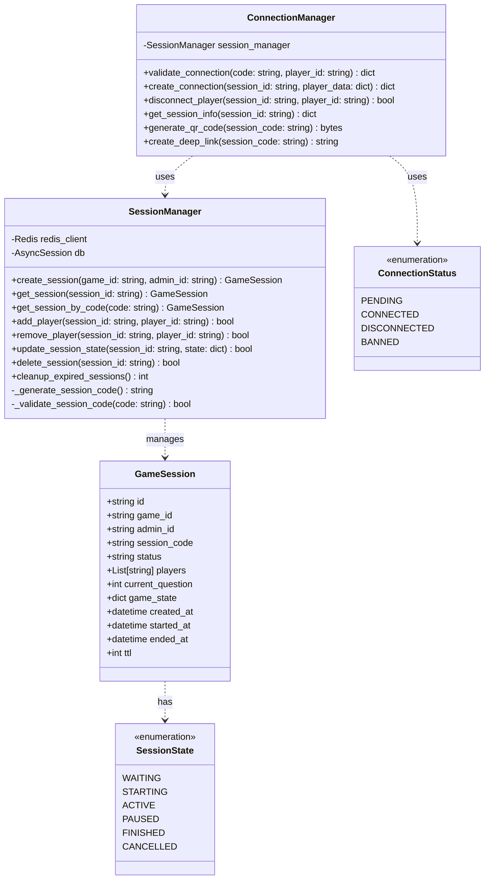
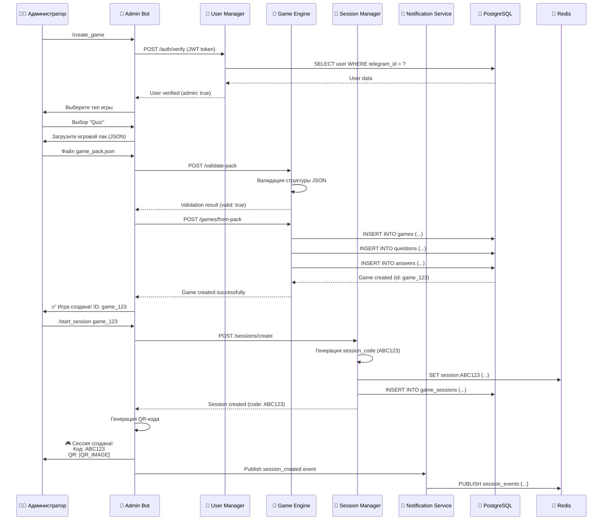
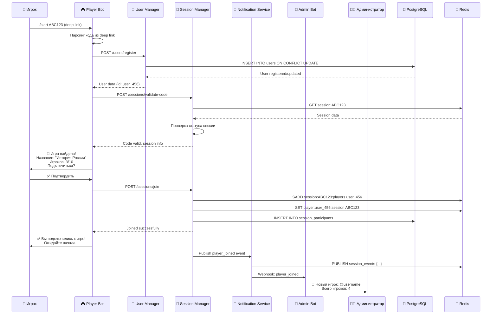
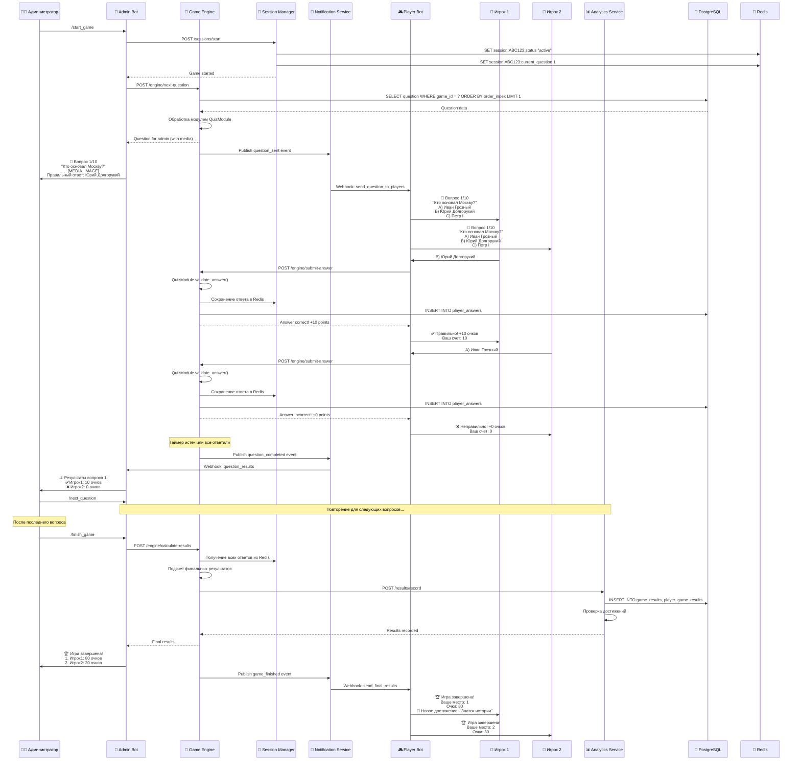
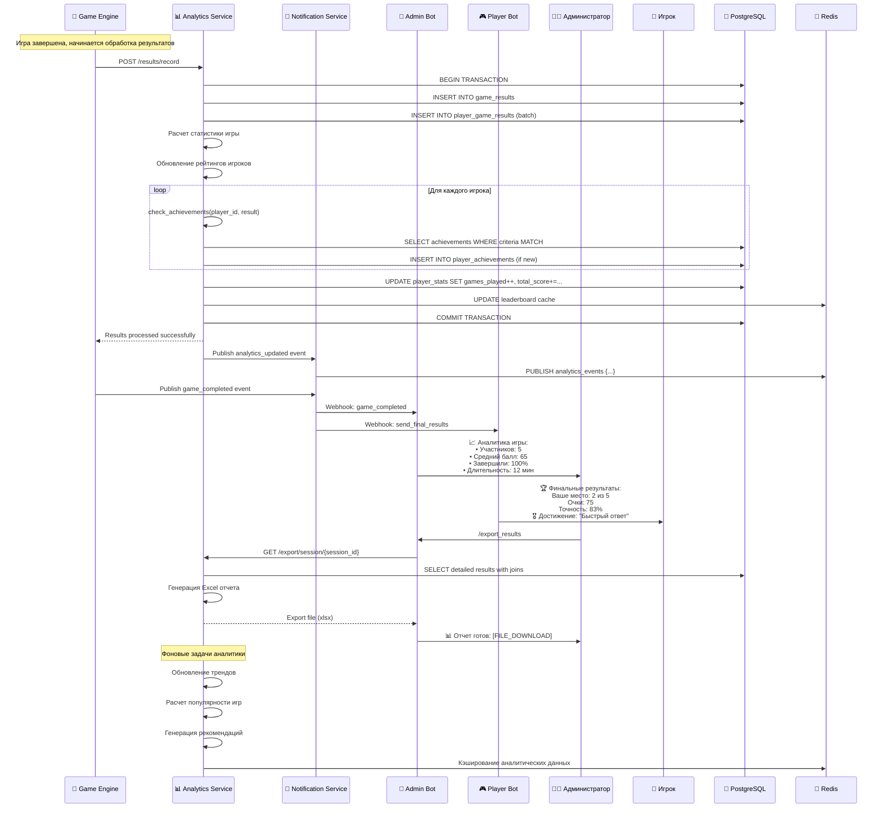

# Полная техническая документация Game Telegram

## Содержание

1. [Обзор системы](#обзор-системы)
2. [Архитектура системы](#архитектура-системы)
3. [Схемы взаимодействия компонентов](#схемы-взаимодействия-компонентов)
4. [Диаграмма развертывания Docker](#диаграмма-развертывания-docker)
5. [UML диаграммы классов](#uml-диаграммы-классов)
6. [ER-диаграммы базы данных](#er-диаграммы-базы-данных)
7. [Диаграммы последовательности](#диаграммы-последовательности)
8. [Сценарии взаимодействия](#сценарии-взаимодействия)
9. [Руководство для разработчиков](#руководство-для-разработчиков)
10. [API Reference](#api-reference)
11. [Мониторинг и логирование](#мониторинг-и-логирование)

---

## Обзор системы

Game Telegram - это микросервисная платформа для проведения интерактивных игр через Telegram ботов. Система поддерживает различные типы игр (викторины, "100 к одному") и обеспечивает масштабируемость для множественных игровых сессий.

### Ключевые особенности

- **Микросервисная архитектура** с 7 основными сервисами
- **Двухботовая система**: отдельные боты для администраторов и игроков
- **Модульная система игр** с поддержкой расширений
- **QR-коды и deep links** для быстрого подключения игроков
- **Реальное время** обработки ответов и результатов
- **Аналитика и мониторинг** игровых сессий
- **Docker контейнеризация** для простого развертывания

### Технологический стек

- **Backend**: Python 3.11+, FastAPI, SQLAlchemy
- **Базы данных**: PostgreSQL, Redis
- **Боты**: aiogram 3.x
- **Контейнеризация**: Docker, Docker Compose
- **Мониторинг**: Prometheus, Grafana
- **Веб-сервер**: Nginx

---

## Архитектура системы

### Общая архитектурная диаграмма



### Описание сервисов

#### 1. User Manager (Управление пользователями)
- **Порт**: 8001
- **Назначение**: Аутентификация, авторизация, управление пользователями
- **База данных**: PostgreSQL
- **Основные функции**:
  - Регистрация и аутентификация пользователей
  - Управление ролями (admin/player)
  - JWT токены и сессии
  - Проверка прав доступа

#### 2. Game Engine (Игровой движок)
- **Порт**: 8002
- **Назначение**: Обработка игровой логики
- **База данных**: PostgreSQL + File Storage
- **Основные функции**:
  - Загрузка и управление игровыми модулями
  - Обработка вопросов и ответов
  - Подсчет очков и результатов
  - Валидация игровых паков

#### 3. Session Manager (Управление сессиями)
- **Порт**: 8003
- **Назначение**: Управление игровыми сессиями
- **База данных**: Redis + PostgreSQL
- **Основные функции**:
  - Создание и управление игровыми сессиями
  - Генерация кодов подключения
  - Управление состоянием игры
  - Кэширование активных данных

#### 4. Notification Service (Сервис уведомлений)
- **Порт**: 8004
- **Назначение**: Система уведомлений
- **База данных**: Redis
- **Основные функции**:
  - Отправка уведомлений через ботов
  - Управление очередью сообщений
  - Retry механизм
  - Pub/Sub события

#### 5. Analytics Service (Сервис аналитики)
- **Порт**: 8005
- **Назначение**: Аналитика и статистика
- **База данных**: PostgreSQL
- **Основные функции**:
  - Сбор и анализ игровых данных
  - Генерация отчетов
  - Система достижений
  - Экспорт данных

#### 6. Admin Bot (Бот администратора)
- **Порт**: 8080
- **Назначение**: Интерфейс для администраторов
- **Основные функции**:
  - Создание и управление играми
  - Запуск игровых сессий
  - Валидация ответов игроков
  - Просмотр аналитики

#### 7. Player Bot (Бот игрока)
- **Порт**: 8081
- **Назначение**: Интерфейс для игроков
- **Основные функции**:
  - Подключение к играм по коду/QR
  - Ответы на вопросы
  - Просмотр результатов
  - Получение уведомлений

---

## Схемы взаимодействия компонентов

### Межсервисное взаимодействие



### Потоки данных



---

## Диаграмма развертывания Docker



### Docker Compose конфигурация

Система развертывается с помощью Docker Compose со следующими особенностями:

- **Сеть**: Единая bridge сеть `game-network` для всех сервисов
- **Зависимости**: Четко определенные зависимости между сервисами
- **Health checks**: Проверки здоровья для критических сервисов
- **Volumes**: Персистентное хранение данных
- **Environment**: Конфигурация через переменные окружения

---

## UML диаграммы классов

### User Manager Service

```mermaid
classDiagram
    class User {
        +int id
        +int telegram_id
        +string username
        +string first_name
        +string last_name
        +string language_code
        +bool is_active
        +bool is_admin
        +datetime created_at
        +datetime updated_at
        +__repr__() string
    }
    
    class UserSession {
        +int id
        +int user_id
        +string session_token
        +datetime expires_at
        +bool is_active
        +datetime created_at
        +datetime updated_at
        +__repr__() string
    }
    
    class AuthService {
        -CryptContext pwd_context
        -Settings settings
        +create_access_token(data: dict) string
        +verify_token(token: string) dict
        +hash_password(password: string) string
        +verify_password(plain: string, hashed: string) bool
        +create_user_session(user_id: int) UserSession
        +invalidate_session(token: string) bool
        +get_current_user(token: string) User
    }
    
    class UserService {
        -AsyncSession db
        +create_user(user_data: UserCreate) User
        +get_user(user_id: int) User
        +get_user_by_telegram_id(telegram_id: int) User
        +update_user(user_id: int, user_data: UserUpdate) User
        +delete_user(user_id: int) bool
        +check_admin(user_id: int) bool
        +get_users(skip: int, limit: int) List[User]
    }
    
    User ||--o{ UserSession : has
    AuthService ..> User : manages
    AuthService ..> UserSession : creates
    UserService ..> User : CRUD operations
```

### Game Engine Service

```mermaid
classDiagram
    class Game {
        +int id
        +string name
        +string description
        +string game_type
        +string difficulty
        +bool is_active
        +int created_by
        +datetime created_at
        +datetime updated_at
    }
    
    class GamePack {
        +int id
        +string name
        +string description
        +string game_type
        +dict pack_data
        +bool is_active
        +int created_by
        +datetime created_at
        +datetime updated_at
    }
    
    class Question {
        +int id
        +int game_id
        +string question_text
        +string question_type
        +string difficulty
        +int points
        +int time_limit
        +dict extra_data
        +datetime created_at
    }
    
    class Answer {
        +int id
        +int question_id
        +string answer_text
        +bool is_correct
        +int points
        +datetime created_at
    }
    
    class MediaFile {
        +int id
        +string filename
        +string original_filename
        +string file_type
        +int file_size
        +string file_path
        +string mime_type
        +datetime created_at
    }
    
    class GameModule {
        <<abstract>>
        +process_question(question: Question, session: dict) dict
        +validate_answer(answer: str, question: Question) bool
        +calculate_score(answers: List[Answer]) int
        +get_results(session: dict) dict
    }
    
    class QuizModule {
        +process_question(question: Question, session: dict) dict
        +validate_answer(answer: str, question: Question) bool
        +calculate_score(answers: List[Answer]) int
        +get_results(session: dict) dict
        -_check_multiple_choice(answer: str, correct: List[str]) bool
        -_calculate_time_bonus(time_taken: int, time_limit: int) float
    }
    
    class FamilyFeudModule {
        +process_question(question: Question, session: dict) dict
        +validate_answer(answer: str, question: Question) bool
        +calculate_score(answers: List[Answer]) int
        +get_results(session: dict) dict
        -_find_closest_answer(answer: str, answers: List[str]) tuple
        -_calculate_popularity_score(answer: str, popularity: int) int
    }
    
    class ModuleLoader {
        -dict loaded_modules
        +load_module(game_type: string) GameModule
        +get_module(game_type: string) GameModule
        +reload_modules() bool
        +list_available_modules() List[string]
    }
    
    Game ||--o{ Question : contains
    Question ||--o{ Answer : has
    Game ||--o{ MediaFile : uses
    GameModule <|-- QuizModule
    GameModule <|-- FamilyFeudModule
    ModuleLoader ..> GameModule : manages
```

### Session Manager Service



### Analytics Service

```mermaid
classDiagram
    class GameResult {
        +int id
        +string session_id
        +string game_id
        +string game_name
        +string game_type
        +int total_players
        +int total_questions
        +float average_score
        +float completion_rate
        +int duration_seconds
        +datetime started_at
        +datetime finished_at
        +datetime created_at
    }
    
    class PlayerGameResult {
        +int id
        +int game_result_id
        +string player_id
        +string player_name
        +int final_score
        +int correct_answers
        +int total_answers
        +float accuracy_rate
        +int rank
        +bool completed
        +datetime created_at
    }
    
    class Achievement {
        +int id
        +string name
        +string description
        +string category
        +dict criteria
        +string badge_icon
        +int points_reward
        +bool is_active
        +datetime created_at
    }
    
    class PlayerAchievement {
        +int id
        +string player_id
        +int achievement_id
        +datetime earned_at
        +dict progress_data
    }
    
    class AnalyticsService {
        -AsyncSession db
        -Redis redis_client
        +record_game_result(result_data: dict) GameResult
        +get_player_stats(player_id: string) dict
        +get_game_analytics(game_id: string) dict
        +get_leaderboard(game_type: string, limit: int) List[dict]
        +generate_report(session_id: string) dict
        +check_achievements(player_id: string, result: PlayerGameResult) List[Achievement]
        -_calculate_player_rating(player_id: string) float
        -_update_leaderboard_cache(game_type: string) bool
    }
    
    class MetricsCollector {
        -AnalyticsService analytics
        +collect_session_metrics(session_id: string) dict
        +collect_system_metrics() dict
        +collect_performance_metrics() dict
        +export_metrics(format: string, filters: dict) bytes
    }
    
    GameResult ||--o{ PlayerGameResult : contains
    PlayerAchievement }o--|| Achievement : references
    AnalyticsService ..> GameResult : manages
    AnalyticsService ..> PlayerGameResult : manages
    AnalyticsService ..> Achievement : manages
    AnalyticsService ..> PlayerAchievement : manages
    MetricsCollector ..> AnalyticsService : uses
```

---

## ER-диаграммы базы данных

### Основная схема базы данных

```mermaid
erDiagram
    users {
        int id PK
        bigint telegram_id UK
        varchar username
        varchar first_name
        varchar last_name
        varchar language_code
        boolean is_active
        boolean is_admin
        timestamp created_at
        timestamp updated_at
    }
    
    user_sessions {
        int id PK
        int user_id FK
        varchar session_token UK
        timestamp expires_at
        boolean is_active
        timestamp created_at
        timestamp updated_at
    }
    
    games {
        int id PK
        varchar name
        text description
        varchar game_type
        varchar difficulty
        boolean is_active
        int created_by FK
        timestamp created_at
        timestamp updated_at
    }
    
    game_packs {
        int id PK
        varchar name
        text description
        varchar game_type
        jsonb pack_data
        boolean is_active
        int created_by FK
        timestamp created_at
        timestamp updated_at
    }
    
    questions {
        int id PK
        int game_id FK
        text question_text
        varchar question_type
        varchar difficulty
        int points
        int time_limit
        jsonb extra_data
        timestamp created_at
    }
    
    answers {
        int id PK
        int question_id FK
        text answer_text
        boolean is_correct
        int points
        timestamp created_at
    }
    
    game_sessions {
        uuid id PK
        int game_id FK
        int admin_id FK
        varchar session_code UK
        varchar status
        uuid current_question_id FK
        timestamp started_at
        timestamp ended_at
        timestamp created_at
    }
    
    session_participants {
        uuid id PK
        uuid session_id FK
        int user_id FK
        timestamp joined_at
        int score
    }
    
    player_answers {
        uuid id PK
        uuid session_id FK
        int question_id FK
        int user_id FK
        text answer_text
        boolean is_correct
        int points_earned
        timestamp answered_at
        int validated_by FK
        timestamp validated_at
    }
    
    media_files {
        int id PK
        varchar filename
        varchar original_filename
        varchar file_type
        int file_size
        varchar file_path
        varchar mime_type
        timestamp created_at
    }
    
    game_results {
        int id PK
        varchar session_id
        varchar game_id
        varchar game_name
        varchar game_type
        int total_players
        int total_questions
        float average_score
        float completion_rate
        int duration_seconds
        timestamp started_at
        timestamp finished_at
        timestamp created_at
    }
    
    player_game_results {
        int id PK
        int game_result_id FK
        varchar player_id
        varchar player_name
        int final_score
        int correct_answers
        int total_answers
        float accuracy_rate
        int rank
        boolean completed
        timestamp created_at
    }
    
    achievements {
        int id PK
        varchar name
        text description
        varchar category
        jsonb criteria
        varchar badge_icon
        int points_reward
        boolean is_active
        timestamp created_at
    }
    
    player_achievements {
        int id PK
        varchar player_id
        int achievement_id FK
        timestamp earned_at
        jsonb progress_data
    }
    
    %% Relationships
    users ||--o{ user_sessions : has
    users ||--o{ games : creates
    users ||--o{ game_packs : creates
    users ||--o{ game_sessions : administers
    users ||--o{ session_participants : participates
    users ||--o{ player_answers : submits
    
    games ||--o{ questions : contains
    games ||--o
    games ||--o{ game_sessions : used_in
    questions ||--o{ answers : has
    questions ||--o{ player_answers : answered
    
    game_sessions ||--o{ session_participants : has
    game_sessions ||--o{ player_answers : contains
    
    game_results ||--o{ player_game_results : contains
    achievements ||--o{ player_achievements : earned_by
```

### Индексы и ограничения

```sql
-- Основные индексы для производительности
CREATE INDEX idx_users_telegram_id ON users(telegram_id);
CREATE INDEX idx_users_is_admin ON users(is_admin) WHERE is_admin = true;
CREATE INDEX idx_user_sessions_token ON user_sessions(session_token);
CREATE INDEX idx_user_sessions_active ON user_sessions(is_active, expires_at);

CREATE INDEX idx_games_type ON games(game_type);
CREATE INDEX idx_games_active ON games(is_active) WHERE is_active = true;
CREATE INDEX idx_games_created_by ON games(created_by);

CREATE INDEX idx_questions_game_id ON questions(game_id);
CREATE INDEX idx_questions_type ON questions(question_type);
CREATE INDEX idx_answers_question_id ON answers(question_id);

CREATE INDEX idx_sessions_code ON game_sessions(session_code);
CREATE INDEX idx_sessions_status ON game_sessions(status);
CREATE INDEX idx_sessions_admin ON game_sessions(admin_id);

CREATE INDEX idx_participants_session ON session_participants(session_id);
CREATE INDEX idx_participants_user ON session_participants(user_id);

CREATE INDEX idx_player_answers_session_question ON player_answers(session_id, question_id);
CREATE INDEX idx_player_answers_user ON player_answers(user_id);
CREATE INDEX idx_player_answers_timestamp ON player_answers(answered_at);

CREATE INDEX idx_game_results_session ON game_results(session_id);
CREATE INDEX idx_game_results_type ON game_results(game_type);
CREATE INDEX idx_game_results_timestamp ON game_results(created_at);

CREATE INDEX idx_player_results_game ON player_game_results(game_result_id);
CREATE INDEX idx_player_results_player ON player_game_results(player_id);

CREATE INDEX idx_achievements_category ON achievements(category);
CREATE INDEX idx_achievements_active ON achievements(is_active) WHERE is_active = true;
CREATE INDEX idx_player_achievements_player ON player_achievements(player_id);
```

---

## Диаграммы последовательности

### Создание игры администратором



### Подключение игрока к игре



### Проведение викторины



### Обработка результатов и аналитика



---

## Сценарии взаимодействия

### 1. Создание игры администратором

#### Описание сценария
Администратор создает новую игру, загружая игровой пак в формате JSON, и запускает игровую сессию для подключения игроков.

#### Участники
- **Администратор**: Создает и управляет игрой
- **Admin Bot**: Интерфейс администратора
- **Game Engine**: Обработка игровой логики
- **Session Manager**: Управление сессиями
- **User Manager**: Проверка прав доступа

#### Предусловия
- Администратор авторизован в системе
- Игровой пак соответствует требуемому формату
- Все сервисы доступны

#### Основной поток

1. **Инициация создания игры**
   ```
   Администратор → Admin Bot: /create_game
   Admin Bot → User Manager: Проверка прав администратора
   User Manager → Admin Bot: Подтверждение прав
   ```

2. **Выбор типа игры**
   ```
   Admin Bot → Администратор: Меню выбора типа игры
   Администратор → Admin Bot: Выбор "Quiz" / "Family Feud"
   ```

3. **Загрузка игрового пака**
   ```
   Admin Bot → Администратор: Запрос файла игрового пака
   Администратор → Admin Bot: Загрузка JSON файла
   Admin Bot → Game Engine: Валидация пака
   Game Engine → Admin Bot: Результат валидации
   ```

4. **Создание игры**
   ```
   Admin Bot → Game Engine: Создание игры из пака
   Game Engine → PostgreSQL: Сохранение игры и вопросов
   Game Engine → Admin Bot: Подтверждение создания
   ```

5. **Создание игровой сессии**
   ```
   Admin Bot → Session Manager: Создание сессии
   Session Manager → Redis: Сохранение сессии
   Session Manager → Admin Bot: Код сессии и QR-код
   Admin Bot → Администратор: Отображение кода и QR
   ```

#### Альтернативные потоки

**A1. Ошибка валидации игрового пака**
```
Game Engine → Admin Bot: Ошибки валидации
Admin Bot → Администратор: Список ошибок с описанием
Администратор → Admin Bot: Исправленный файл
→ Возврат к шагу 3
```

**A2. Недостаточно прав**
```
User Manager → Admin Bot: Отказ в доступе
Admin Bot → Администратор: Сообщение об ошибке доступа
→ Завершение сценария
```

#### Постусловия
- Игра создана и сохранена в базе данных
- Игровая сессия активна и готова к подключению игроков
- Сгенерирован уникальный код сессии и QR-код
- Администратор получил все необходимые данные для начала игры

### 2. Подключение игрока к игре

#### Описание сценария
Игрок подключается к активной игровой сессии используя код игры или QR-код, предоставленный администратором.

#### Участники
- **Игрок**: Подключается к игре
- **Player Bot**: Интерфейс игрока
- **Session Manager**: Управление подключениями
- **User Manager**: Регистрация пользователей
- **Notification Service**: Уведомления

#### Предусловия
- Игровая сессия создана и активна
- Игрок имеет доступ к Telegram
- Код сессии или QR-код доступен игроку

#### Основной поток

1. **Инициация подключения**
   ```
   Игрок → Player Bot: /start ABC123 (deep link) или /join ABC123
   Player Bot: Парсинг кода сессии
   ```

2. **Регистрация пользователя**
   ```
   Player Bot → User Manager: Регистрация/обновление пользователя
   User Manager → PostgreSQL: Сохранение данных пользователя
   User Manager → Player Bot: Данные пользователя
   ```

3. **Валидация кода сессии**
   ```
   Player Bot → Session Manager: Проверка кода сессии
   Session Manager → Redis: Получение данных сессии
   Session Manager → Player Bot: Информация о сессии
   ```

4. **Отображение информации об игре**
   ```
   Player Bot → Игрок: Информация об игре (название, количество игроков, статус)
   Игрок → Player Bot: Подтверждение подключения
   ```

5. **Подключение к сессии**
   ```
   Player Bot → Session Manager: Добавление игрока в сессию
   Session Manager → Redis: Обновление списка игроков
   Session Manager → PostgreSQL: Запись участника
   Session Manager → Player Bot: Подтверждение подключения
   ```

6. **Уведомления**
   ```
   Session Manager → Notification Service: Событие подключения игрока
   Notification Service → Admin Bot: Уведомление администратору
   Player Bot → Игрок: Подтверждение подключения
   ```

#### Альтернативные потоки

**A1. Неверный код сессии**
```
Session Manager → Player Bot: Код не найден
Player Bot → Игрок: Ошибка "Игра не найдена"
Player Bot → Игрок: Предложение ввести код повторно
```

**A2. Сессия заполнена**
```
Session Manager → Player Bot: Превышен лимит игроков
Player Bot → Игрок: "Игра заполнена, попробуйте позже"
```

**A3. Сессия уже началась**
```
Session Manager → Player Bot: Игра уже идет
Player Bot → Игрок: "Игра уже началась, подключение невозможно"
```

#### Постусловия
- Игрок добавлен в список участников сессии
- Администратор уведомлен о новом игроке
- Игрок ожидает начала игры
- Система готова к отправке вопросов игроку

### 3. Проведение викторины

#### Описание сценария
Администратор проводит викторину, отправляя вопросы игрокам, получая и валидируя ответы, отслеживая прогресс игры.

#### Участники
- **Администратор**: Управляет ходом игры
- **Игроки**: Отвечают на вопросы
- **Admin Bot**: Интерфейс администратора
- **Player Bot**: Интерфейс игроков
- **Game Engine**: Обработка игровой логики
- **Session Manager**: Управление состоянием игры

#### Предусловия
- Игровая сессия создана с подключенными игроками
- Игра содержит вопросы для проведения
- Все участники готовы к началу

#### Основной поток

1. **Запуск игры**
   ```
   Администратор → Admin Bot: /start_game
   Admin Bot → Session Manager: Изменение статуса на "active"
   Session Manager → Notification Service: Уведомление о начале игры
   Notification Service → Player Bot: Уведомление игрокам
   ```

2. **Отправка вопроса**
   ```
   Администратор → Admin Bot: /next_question
   Admin Bot → Game Engine: Запрос следующего вопроса
   Game Engine → PostgreSQL: Получение вопроса
   Game Engine → Quiz Module: Обработка вопроса
   ```

3. **Отображение вопроса**
   ```
   Game Engine → Admin Bot: Вопрос с медиа и правильными ответами
   Game Engine → Notification Service: Вопрос для игроков
   Notification Service → Player Bot: Отправка вопроса игрокам
   Admin Bot → Администратор: Отображение вопроса и ответов
   Player Bot → Игроки: Отображение вопроса с вариантами
   ```

4. **Сбор ответов**
   ```
   Игроки → Player Bot: Выбор ответов
   Player Bot → Game Engine: Отправка ответов
   Game Engine → Quiz Module: Валидация ответов
   Game Engine → Session Manager: Сохранение результатов
   Game Engine → Player Bot: Результат ответа
   ```

5. **Отображение результатов вопроса**
   ```
   Game Engine → Admin Bot: Статистика ответов
   Admin Bot → Администратор: Результаты по вопросу
   Player Bot → Игроки: Индивидуальные результаты
   ```

6. **Переход к следующему вопросу**
   ```
   → Повторение шагов 2-5 для каждого вопроса
   ```

7. **Завершение игры**
   ```
   Администратор → Admin Bot: /finish_game (или автоматически после последнего вопроса)
   Admin Bot → Game Engine: Подсчет финальных результатов
   Game Engine → Analytics Service: Запись результатов
   Game Engine → Notification Service: Финальные результаты
   ```

#### Альтернативные потоки

**A1. Текстовый ответ требует валидации**
```
Game Engine → Admin Bot: Запрос валидации ответа
Admin Bot → Администратор: Отображение ответа игрока
Администратор → Admin Bot: Оценка (правильно/неправильно)
Admin Bot → Game Engine: Результат валидации
Game Engine → Player Bot: Обновленный результат
```

**A2. Игрок не отвечает в течение времени**
```
Game Engine: Таймер истек
Game Engine → Session Manager: Пропуск ответа игрока
Game Engine → Player Bot: Уведомление о пропуске
```

**A3. Технический сбой**
```
Любой сервис → Notification Service: Ошибка системы
Notification Service → Admin Bot: Уведомление об ошибке
Admin Bot → Администратор: Предложение действий (пауза/перезапуск)
```

#### Постусловия
- Все вопросы игры обработаны
- Результаты всех игроков подсчитаны и сохранены
- Финальная таблица результатов отправлена участникам
- Данные игры переданы в аналитическую систему
- Сессия завершена и очищена

### 4. Обработка результатов

#### Описание сценария
После завершения игры система обрабатывает результаты, обновляет статистику игроков, проверяет достижения и генерирует аналитические отчеты.

#### Участники
- **Analytics Service**: Обработка и анализ данных
- **Game Engine**: Подсчет результатов
- **Notification Service**: Отправка уведомлений
- **Admin Bot & Player Bot**: Отображение результатов

#### Предусловия
- Игра завершена
- Все ответы игроков сохранены
- Система готова к обработке результатов

#### Основной поток

1. **Инициация обработки результатов**
   ```
   Game Engine → Analytics Service: Запрос обработки результатов сессии
   Analytics Service → PostgreSQL: Начало транзакции
   ```

2. **Сохранение результатов игры**
   ```
   Analytics Service → PostgreSQL: INSERT INTO game_results
   Analytics Service → PostgreSQL: INSERT INTO player_game_results (batch)
   ```

3. **Обновление статистики игроков**
   ```
   Analytics Service: Для каждого игрока:
   Analytics Service → PostgreSQL: UPDATE player_stats
   - Увеличение количества игр
   - Обновление общего счета
   - Пересчет среднего балла
   - Обновление рейтинга
   ```

4. **Проверка достижений**
   ```
   Analytics Service: Для каждого игрока:
   Analytics Service → PostgreSQL: SELECT achievements WHERE criteria MATCH
   Analytics Service: Проверка условий достижений
   Analytics Service → PostgreSQL: INSERT INTO player_achievements (новые)
   ```

5. **Обновление кэшей и рейтингов**
   ```
   Analytics Service → Redis: Обновление кэша лидерборда
   Analytics Service → Redis: Обновление трендов
   Analytics Service → PostgreSQL: COMMIT транзакции
   ```

6. **Отправка результатов**
   ```
   Analytics Service → Notification Service: Результаты обработаны
   Notification Service → Admin Bot: Аналитика для администратора
   Notification Service → Player Bot: Персональные результаты игрокам
   ```

7. **Генерация отчетов**
   ```
   Analytics Service: Фоновая генерация отчетов
   Analytics Service → File Storage: Сохранение Excel/PDF отчетов
   Analytics Service → Redis: Кэширование аналитических данных
   ```

#### Альтернативные потоки

**A1. Ошибка при сохранении результатов**
```
PostgreSQL → Analytics Service: Ошибка транзакции
Analytics Service → PostgreSQL: ROLLBACK
Analytics Service → Notification Service: Ошибка обработки
Notification Service → Admin Bot: Уведомление об ошибке
Analytics Service: Повторная попытка через 30 секунд
```

**A2. Новое достижение получено**
```
Analytics Service: Обнаружено новое достижение
Analytics Service → Notification Service: Событие достижения
Notification Service → Player Bot: Поздравление с достижением
Player Bot → Игрок: 🎖️ "Новое достижение: [название]"
```

#### Постусловия
- Все результаты сохранены в базе данных
- Статистика игроков обновлена
- Новые достижения присвоены
- Рейтинги и лидерборды актуализированы
- Участники уведомлены о результатах
- Аналитические отчеты готовы для экспорта

---

## Руководство для разработчиков

### Добавление нового типа игры

#### Шаг 1: Создание игрового модуля

Создайте новый модуль в `services/game-engine/app/modules/`:

```python
# services/game-engine/app/modules/word_game_module.py
from typing import Dict, List, Any, Optional
from ..modules.base_module import BaseGameModule
from ..models.game import Question
from ..schemas.engine import GameEngineRequest

class WordGameModule(BaseGameModule):
    """
    Модуль для игры в слова
    """
    
    def __init__(self):
        super().__init__()
        self.game_type = "word_game"
        self.name = "Word Game"
        self.description = "Игра в составление слов из букв"
        self.version = "1.0.0"
    
    async def process_question(
        self, 
        question: Question, 
        session_data: Dict[str, Any]
    ) -> Dict[str, Any]:
        """
        Обработка вопроса для иг
ры в слова
        """
        # Извлечение данных вопроса
        question_data = question.extra_data or {}
        letters = question_data.get('letters', [])
        target_words = question_data.get('target_words', [])
        min_word_length = question_data.get('min_word_length', 3)
        
        # Подготовка данных для администратора
        admin_data = {
            'question_id': question.id,
            'question_text': question.question_text,
            'letters': letters,
            'target_words': target_words,
            'min_length': min_word_length,
            'time_limit': question.time_limit,
            'points': question.points
        }
        
        # Подготовка данных для игроков
        player_data = {
            'question_id': question.id,
            'question_text': question.question_text,
            'letters': letters,
            'min_length': min_word_length,
            'time_limit': question.time_limit,
            'max_words': question_data.get('max_words', 10)
        }
        
        return {
            'admin_data': admin_data,
            'player_data': player_data,
            'question_type': 'word_game'
        }
    
    async def validate_answer(
        self, 
        answer: str, 
        question: Question, 
        session_data: Dict[str, Any]
    ) -> Dict[str, Any]:
        """
        Валидация ответа игрока
        """
        question_data = question.extra_data or {}
        letters = question_data.get('letters', [])
        target_words = question_data.get('target_words', [])
        min_word_length = question_data.get('min_word_length', 3)
        
        # Парсинг ответа (список слов через запятую)
        submitted_words = [word.strip().lower() for word in answer.split(',')]
        valid_words = []
        points_earned = 0
        
        for word in submitted_words:
            if self._is_valid_word(word, letters, min_word_length):
                if word in [tw.lower() for tw in target_words]:
                    valid_words.append(word)
                    # Очки зависят от длины слова
                    points_earned += len(word) * 2
        
        is_correct = len(valid_words) > 0
        
        return {
            'is_correct': is_correct,
            'points_earned': points_earned,
            'valid_words': valid_words,
            'total_words': len(submitted_words),
            'feedback': f"Найдено слов: {len(valid_words)}/{len(submitted_words)}"
        }
    
    async def calculate_score(
        self, 
        answers: List[Dict[str, Any]], 
        session_data: Dict[str, Any]
    ) -> Dict[str, Any]:
        """
        Подсчет общего счета игрока
        """
        total_score = sum(answer.get('points_earned', 0) for answer in answers)
        total_words = sum(len(answer.get('valid_words', [])) for answer in answers)
        
        return {
            'total_score': total_score,
            'total_words_found': total_words,
            'average_word_length': total_score / (total_words * 2) if total_words > 0 else 0
        }
    
    async def get_results(
        self, 
        session_data: Dict[str, Any]
    ) -> Dict[str, Any]:
        """
        Формирование финальных результатов
        """
        players = session_data.get('players', [])
        results = []
        
        for player in players:
            player_score = await self.calculate_score(
                player.get('answers', []), 
                session_data
            )
            results.append({
                'player_id': player['id'],
                'player_name': player['name'],
                'score': player_score['total_score'],
                'words_found': player_score['total_words_found'],
                'avg_word_length': player_score['average_word_length']
            })
        
        # Сортировка по очкам
        results.sort(key=lambda x: x['score'], reverse=True)
        
        return {
            'results': results,
            'game_type': self.game_type,
            'total_players': len(results)
        }
    
    def _is_valid_word(self, word: str, available_letters: List[str], min_length: int) -> bool:
        """
        Проверка, можно ли составить слово из доступных букв
        """
        if len(word) < min_length:
            return False
        
        letter_count = {}
        for letter in available_letters:
            letter_count[letter.lower()] = letter_count.get(letter.lower(), 0) + 1
        
        for letter in word:
            if letter not in letter_count or letter_count[letter] == 0:
                return False
            letter_count[letter] -= 1
        
        return True
```

#### Шаг 2: Регистрация модуля

Добавьте модуль в загрузчик модулей:

```python
# services/game-engine/app/services/module_loader.py
from ..modules.word_game_module import WordGameModule

class ModuleLoader:
    def __init__(self):
        self.modules = {
            'quiz': QuizModule(),
            'family_feud': FamilyFeudModule(),
            'word_game': WordGameModule(),  # Новый модуль
        }
```

#### Шаг 3: Создание схемы игрового пака

Создайте схему для нового типа игры:

```python
# services/game-engine/app/game_schemas/word_game.py
from pydantic import BaseModel, validator
from typing import List, Optional

class WordGameQuestion(BaseModel):
    """Схема вопроса для игры в слова"""
    question_text: str
    letters: List[str]
    target_words: List[str]
    min_word_length: int = 3
    max_words: int = 10
    time_limit: int = 60
    points: int = 10
    
    @validator('letters')
    def validate_letters(cls, v):
        if len(v) < 5:
            raise ValueError('Должно быть минимум 5 букв')
        return [letter.upper() for letter in v]
    
    @validator('target_words')
    def validate_target_words(cls, v):
        if len(v) == 0:
            raise ValueError('Должно быть минимум одно целевое слово')
        return [word.lower() for word in v]

class WordGamePack(BaseModel):
    """Схема игрового пака для игры в слова"""
    metadata: dict
    questions: List[WordGameQuestion]
    
    @validator('questions')
    def validate_questions(cls, v):
        if len(v) == 0:
            raise ValueError('Игровой пак должен содержать вопросы')
        return v
```

#### Шаг 4: Обновление API

Добавьте поддержку нового типа игры в API:

```python
# services/game-engine/app/api/games.py
from ..game_schemas.word_game import WordGamePack

@router.post("/validate-pack", response_model=GamePackValidation)
async def validate_game_pack(
    game_type: str,
    pack_data: dict,
    db: AsyncSession = Depends(get_db)
):
    """Валидация игрового пака"""
    try:
        if game_type == "quiz":
            QuizGamePack(**pack_data)
        elif game_type == "family_feud":
            FamilyFeudGamePack(**pack_data)
        elif game_type == "word_game":  # Новый тип
            WordGamePack(**pack_data)
        else:
            raise ValueError(f"Неподдерживаемый тип игры: {game_type}")
        
        return GamePackValidation(
            is_valid=True,
            errors=[],
            warnings=[]
        )
    except Exception as e:
        return GamePackValidation(
            is_valid=False,
            errors=[str(e)],
            warnings=[]
        )
```

#### Шаг 5: Обновление ботов

Добавьте обработку нового типа игры в ботах:

```python
# services/admin-bot/app/handlers/game_handlers.py
async def handle_word_game_question(self, message: Message, question_data: dict):
    """Обработка вопроса игры в слова для администратора"""
    letters = question_data['letters']
    target_words = question_data['target_words']
    
    text = f"🔤 Вопрос: {question_data['question_text']}\n\n"
    text += f"Буквы: {' '.join(letters)}\n"
    text += f"Целевые слова ({len(target_words)}):\n"
    text += "\n".join(f"• {word}" for word in target_words)
    
    await message.answer(text)

# services/player-bot/app/handlers/question_handlers.py
async def handle_word_game_question(self, message: Message, question_data: dict):
    """Обработка вопроса игры в слова для игрока"""
    letters = question_data['letters']
    min_length = question_data['min_length']
    max_words = question_data['max_words']
    
    text = f"🔤 {question_data['question_text']}\n\n"
    text += f"Доступные буквы: {' '.join(letters)}\n"
    text += f"Минимальная длина слова: {min_length}\n"
    text += f"Максимум слов: {max_words}\n\n"
    text += "Введите слова через запятую:"
    
    keyboard = InlineKeyboardBuilder()
    keyboard.button(text="Подсказка", callback_data="hint")
    keyboard.button(text="Пропустить", callback_data="skip")
    
    await message.answer(text, reply_markup=keyboard.as_markup())
```

#### Шаг 6: Создание примера игрового пака

```json
{
  "metadata": {
    "name": "Игра в слова: Животные",
    "description": "Составьте слова из букв на тему животных",
    "author": "Game Creator",
    "version": "1.0",
    "difficulty": "medium",
    "estimated_time": 15
  },
  "questions": [
    {
      "question_text": "Составьте названия животных из данных букв",
      "letters": ["К", "О", "Т", "С", "О", "Б", "А", "К", "А"],
      "target_words": ["кот", "собака", "коса", "сок", "бок"],
      "min_word_length": 3,
      "max_words": 5,
      "time_limit": 90,
      "points": 15
    }
  ]
}
```

### Расширение функциональности ботов

#### Добавление нового обработчика команд

1. **Создание обработчика**:

```python
# services/admin-bot/app/handlers/custom_handlers.py
from aiogram import Router, F
from aiogram.types import Message, CallbackQuery
from aiogram.filters import Command

router = Router()

@router.message(Command("custom_command"))
async def custom_command_handler(message: Message, api_client: APIClient):
    """Обработчик пользовательской команды"""
    user_id = message.from_user.id
    
    # Проверка прав доступа
    if not await api_client.check_admin(user_id):
        await message.answer("❌ Недостаточно прав")
        return
    
    # Логика команды
    try:
        result = await api_client.custom_api_call()
        await message.answer(f"✅ Результат: {result}")
    except Exception as e:
        await message.answer(f"❌ Ошибка: {e}")

@router.callback_query(F.data.startswith("custom_"))
async def custom_callback_handler(callback: CallbackQuery, api_client: APIClient):
    """Обработчик пользовательских callback'ов"""
    action = callback.data.split("_", 1)[1]
    
    if action == "action1":
        await callback.message.edit_text("Выполнено действие 1")
    elif action == "action2":
        await callback.message.edit_text("Выполнено действие 2")
    
    await callback.answer()
```

2. **Регистрация обработчика**:

```python
# services/admin-bot/app/main.py
from .handlers import custom_handlers

async def setup_handlers(dp: Dispatcher):
    """Настройка обработчиков"""
    dp.include_router(admin_handlers.router)
    dp.include_router(game_handlers.router)
    dp.include_router(custom_handlers.router)  # Новый обработчик
```

#### Создание middleware

```python
# services/admin-bot/app/middlewares/custom_middleware.py
from aiogram import BaseMiddleware
from aiogram.types import TelegramObject
from typing import Callable, Dict, Any, Awaitable

class CustomMiddleware(BaseMiddleware):
    """Пользовательский middleware"""
    
    async def __call__(
        self,
        handler: Callable[[TelegramObject, Dict[str, Any]], Awaitable[Any]],
        event: TelegramObject,
        data: Dict[str, Any]
    ) -> Any:
        # Логика до обработки
        start_time = time.time()
        
        try:
            # Выполнение обработчика
            result = await handler(event, data)
            
            # Логика после успешной обработки
            execution_time = time.time() - start_time
            logger.info(f"Handler executed in {execution_time:.2f}s")
            
            return result
        except Exception as e:
            # Логика обработки ошибок
            logger.error(f"Handler error: {e}")
            raise
```

### Добавление новых API endpoints

#### Шаг 1: Создание схем данных

```python
# services/analytics-service/app/schemas/custom.py
from pydantic import BaseModel
from typing import List, Optional
from datetime import datetime

class CustomAnalyticsRequest(BaseModel):
    """Запрос пользовательской аналитики"""
    metric_type: str
    date_from: datetime
    date_to: datetime
    filters: Optional[dict] = None

class CustomAnalyticsResponse(BaseModel):
    """Ответ пользовательской аналитики"""
    metric_type: str
    data: List[dict]
    total_count: int
    generated_at: datetime
```

#### Шаг 2: Создание сервиса

```python
# services/analytics-service/app/services/custom_service.py
from sqlalchemy.ext.asyncio import AsyncSession
from typing import List, Dict, Any
from datetime import datetime

class CustomAnalyticsService:
    """Сервис пользовательской аналитики"""
    
    def __init__(self, db: AsyncSession):
        self.db = db
    
    async def get_custom_metrics(
        self, 
        metric_type: str,
        date_from: datetime,
        date_to: datetime,
        filters: Dict[str, Any] = None
    ) -> List[Dict[str, Any]]:
        """Получение пользовательских метрик"""
        
        if metric_type == "player_engagement":
            return await self._get_player_engagement_metrics(
                date_from, date_to, filters
            )
        elif metric_type == "game_popularity":
            return await self._get_game_popularity_metrics(
                date_from, date_to, filters
            )
        else:
            raise ValueError(f"Неподдерживаемый тип метрики: {metric_type}")
    
    async def _get_player_engagement_metrics(
        self,
        date_from: datetime,
        date_to: datetime,
        filters: Dict[str, Any] = None
    ) -> List[Dict[str, Any]]:
        """Метрики вовлеченности игроков"""
        # Реализация запроса к базе данных
        pass
```

#### Шаг 3: Создание API endpoint

```python
# services/analytics-service/app/api/custom.py
from fastapi import APIRouter, Depends, HTTPException
from sqlalchemy.ext.asyncio import AsyncSession
from ..schemas.custom import CustomAnalyticsRequest, CustomAnalyticsResponse
from ..services.custom_service import CustomAnalyticsService
from ..models.database import get_db

router = APIRouter(prefix="/custom", tags=["custom"])

@router.post("/analytics", response_model=CustomAnalyticsResponse)
async def get_custom_analytics(
    request: CustomAnalyticsRequest,
    db: AsyncSession = Depends(get_db)
):
    """Получение пользовательской аналитики"""
    try:
        service = CustomAnalyticsService(db)
        data = await service.get_custom_metrics(
            request.metric_type,
            request.date_from,
            request.date_to,
            request.filters
        )
        
        return CustomAnalyticsResponse(
            metric_type=request.metric_type,
            data=data,
            total_count=len(data),
            generated_at=datetime.utcnow()
        )
    except ValueError as e:
        raise HTTPException(status_code=400, detail=str(e))
    except Exception as e:
        raise HTTPException(status_code=500, detail="Внутренняя ошибка сервера")
```

#### Шаг 4: Регистрация endpoint

```python
# services/analytics-service/app/main.py
from .api import custom

app.include_router(custom.router, prefix="/api/v1")
```

---

## API Reference

### User Manager Service

#### Authentication Endpoints

**POST /api/v1/auth/login**
```json
{
  "telegram_id": 123456789,
  "username": "player1"
}
```

Response:
```json
{
  "access_token": "eyJ0eXAiOiJKV1QiLCJhbGciOiJIUzI1NiJ9...",
  "token_type": "bearer",
  "expires_in": 3600
}
```

**POST /api/v1/auth/logout**
```json
{
  "token": "eyJ0eXAiOiJKV1QiLCJhbGciOiJIUzI1NiJ9..."
}
```

**GET /api/v1/auth/me**
Headers: `Authorization: Bearer <token>`

Response:
```json
{
  "id": 1,
  "telegram_id": 123456789,
  "username": "player1",
  "first_name": "John",
  "last_name": "Doe",
  "is_admin": false,
  "created_at": "2024-01-01T00:00:00Z"
}
```

#### User Management Endpoints

**POST /api/v1/users/register**
```json
{
  "telegram_id": 123456789,
  "username": "player1",
  "first_name": "John",
  "last_name": "Doe"
}
```

**GET /api/v1/users/{user_id}**

**PUT /api/v1/users/{user_id}**
```json
{
  "username": "new_username",
  "first_name": "New Name"
}
```

**GET /api/v1/users/{user_id}/is_admin**

Response:
```json
{
  "is_admin": true,
  "user_id": 1
}
```

### Game Engine Service

#### Game Management Endpoints

**GET /api/v1/games**

Query parameters:
- `skip`: int = 0
- `limit`: int = 100
- `game_type`: str (optional)
- `is_active`: bool (optional)

**POST /api/v1/games**
```json
{
  "name": "История России",
  "description": "Викторина по истории России",
  "game_type": "quiz",
  "difficulty": "medium"
}
```

**GET /api/v1/games/{game_id}**

**PUT /api/v1/games/{game_id}**

**DELETE /api/v1/games/{game_id}**

#### Game Pack Endpoints

**POST /api/v1/games/validate-pack**
```json
{
  "game_type": "quiz",
  "pack_data": {
    "metadata": {...},
    "questions": [...]
  }
}
```

Response:
```json
{
  "is_valid": true,
  "errors": [],
  "warnings": ["Рекомендуется добавить больше вопросов"]
}
```

**POST /api/v1/games/from-pack**
```json
{
  "pack_data": {...},
  "created_by": 1
}
```

#### Game Engine Endpoints

**POST /api/v1/engine/process-question**
```json
{
  "session_id": "session_123",
  "question_id": 1,
  "game_type": "quiz"
}
```

**POST /api/v1/engine/submit-answer**
```json
{
  "session_id": "session_123",
  "question_id": 1,
  "user_id": 1,
  "answer": "Юрий Долгорукий"
}
```

**POST /api/v1/engine/validate-answer**
```json
{
  "answer_id": "answer_123",
  "is_correct": true,
  "points": 10
}
```

**POST /api/v1/engine/calculate-results**
```json
{
  "session_id": "session_123"
}
```

### Session Manager Service

#### Session Management Endpoints

**POST /api/v1/sessions/create**
```json
{
  "game_id": 1,
  "admin_id": 1,
  "max_players": 10
}
```

Response:
```json
{
  "id": "session_123",
  "session_code": "ABC123",
  "status": "waiting",
  "created_at": "2024-01-01T00:00:00Z"
}
```

**GET /api/v1/sessions/{session_id}**

**POST /api/v1/sessions/{session_id}/join**
```json
{
  "user_id": 1,
  "display_name": "Player 1"
}
```

**POST /api/v1/sessions/{session_id}/leave**
```json
{
  "user_id": 1
}
```

**POST /api/v1/sessions/{session_id}/start**

**POST /api/v1/sessions/{session_id}/finish**

#### Connection Endpoints

**POST /api/v1/connections/validate-code**
```json
{
  "game_code": "ABC123"
}
```

Response:
```json
{
  "is_valid": true,
  "session_info": {
    "id": "session_123",
    "game_name": "История России",
    "players_count": 3,
    "max_players": 10,
    "status": "waiting"
  }
}
```

**POST /api/v1/connections/qr-code**
```json
{
  "session_code": "ABC123",
  "size": 200,
  "format": "PNG"
}
```

Response:
```json
{
  "qr_code_data": "data:image/png;base64,iVBORw0KGgoAAAANSUhEUgAA...",
  "deep_link": "https://t.me/player_bot?start=ABC123"
}
```

### Analytics Service

#### Results Endpoints

**POST /api/v1/results/record**
```json
{
  "session_id": "session_123",
  "game_result": {
    "game_id": 1,
    "game_name": "История России",
    "total_players": 5,
    "duration_seconds": 720
  },
  "player_results": [
    {
      "player_id": 1,
      "final_score": 85,
      "correct_answers": 8,
      "total_answers": 10
    }
  ]
}
```

**GET /api/v1/results/session/{session_id}**

**GET /api/v1/results/player/{player_id}**

Query parameters:
- `limit`: int = 10
- `game_type`: str (optional)

#### Leaderboard Endpoints

**GET /api/v1/leaderboard/global**

Query parameters:
- `limit`: int = 10
- `game_type`: str (optional)

Response:
```json
{
  "leaderboard": [
    {
      "rank": 1,
      "player_id": 1,
      "player_name": "Player 1",
      "total_score": 1250,
      "games_played": 15,
      "average_score": 83.3
    }
  ],
  "total_players": 100,
  "generated_at": "2024-01-01T00:00:00Z"
}
```

**GET /api/v1/leaderboard/weekly**

**GET /api/v1/leaderboard/game/{game_type}**

#### Analytics Endpoints

**GET /api/v1/analytics/session/{session_id}**

**GET /api/v1/analytics/game/{game_name}**

**GET /api/v1/analytics/system**

Response:
```json
{
  "total_games": 150,
  "total_players": 500,
  "active_sessions": 5,
  "average_session_duration": 12.5,
  "popular_game_types": [
    {"type": "quiz", "count": 80},
    {"type": "family_feud", "count": 70}
  ]
}
```

#### Export Endpoints

**POST /api/v1/export**
```json
{
  "format": "excel",
  "data_type": "session_results",
  "session_id": "session_123",
  "include_details": true
}
```

Response:
```json
{
  "export_id": "export_456",
  "download_url": "/api/v1/export/download/export_456",
  "expires_at": "2024-01-01T01:00:00Z"
}
```

### Notification Service

#### Notification Endpoints

**POST /api/v1/notifications**
```json
{
  "type": "game_started",
  "priority": "high",
  "channel": "telegram",
  "recipients": ["user_123", "user_456"],
  "content": {
    "title": "Игра началась!",
    "message": "Приготовьтесь к первому вопросу",
    "action_url": "https://t.me/player_bot"
  }
}
```

**POST /api/v1/notifications/batch**
```json
{
  "notifications": [
    {
      "type": "question_sent",
      "recipients": ["user_123"],
      "content": {...}
    }
  ]
}
```

**POST /api/v1/notifications/connection**
```json
{
  "session_id": "session_123",
  "player_id": "user_123",
  "event_type": "player_joined"
}
```

---

## Мониторинг и логирование

### Настройка Prometheus метрик

#### Шаг 1: Добавление метрик в сервисы

```python
# shared/monitoring/metrics.py
from prometheus_client import Counter, Histogram, Gauge, start_http_server
import time
from functools import wraps

# Определение метрик
REQUEST_COUNT = Counter(
    'http_requests_total',
    'Total HTTP requests',
    ['method', 'endpoint', 'status']
)

REQUEST_DURATION = Histogram(
    'http_request_duration_seconds',
    'HTTP request duration',
    ['method', 'endpoint']
)

ACTIVE_SESSIONS = Gauge(
    'active_game_sessions',
    'Number of active game sessions'
)

CONNECTED_PLAYERS = Gauge(
    'connected_players_total',
    'Total number of connected players'
)

GAME_RESULTS = Counter(
    'games_completed_total',
    'Total number of completed games',
    ['game_type']
)

def track_requests(func):
    """Декоратор для отслеживания HTTP запросов"""
    @wraps(func)
    async def wrapper(*args, **kwargs):
        start_time = time.time()
        status = "200"
        
        try:
            result = await func(*args, **kwargs)
            return result
        except Exception as e:
            status = "500"
            raise
        finally:
            duration = time.time() - start_time
            REQUEST_DURATION.labels(
                method="POST",  # Определить из контекста
                endpoint=func.__name__
            ).observe(duration)
            REQUEST_COUNT.labels(
                method="POST",
                endpoint=func.__name__,
                status=status
            ).inc()
    
    return wrapper

class MetricsCollector:
    """Сборщик метрик для сервисов"""
    
    @staticmethod
    def update_active_sessions(count: int):
        """Обновление количества активных сессий"""
        ACTIVE_SESSIONS.set(count)
    
    @staticmethod
    def update_connected_players(count: int):
        """Обновление количества подключенных игроков"""
        CONNECTED_PLAYERS.set(count)
    
    @staticmethod
    def record_game_completion(game_type: str):
        """Запись завершения игры"""
        GAME_RESULTS.labels(game_type=game_type).inc()
```

#### Шаг 2: Интеграция в сервисы

```python
# services/session-manager/app/main.py
from shared.monitoring.metrics import MetricsCollector, track_requests
from prometheus_client import start_http_server

@app.on_event("startup")
async def startup_event():
    """Запуск метрик сервера"""
    start_http_server(8000)  # Порт для метрик

@track_requests
@app.post("/sessions/create")
async def create_session(request: SessionCreateRequest):
    """
Создание сессии с отслеживанием метрик"""
    session = await session_service.create_session(request)
    
    # Обновление метрик
    active_count = await session_service.get_active_sessions_count()
    MetricsCollector.update_active_sessions(active_count)
    
    return session
```

#### Шаг 3: Конфигурация Prometheus

```yaml
# monitoring/prometheus/prometheus.yml
global:
  scrape_interval: 15s
  evaluation_interval: 15s

rule_files:
  - "rules/*.yml"

scrape_configs:
  - job_name: 'user-manager'
    static_configs:
      - targets: ['user-manager:8000']
    metrics_path: '/metrics'
    scrape_interval: 10s

  - job_name: 'game-engine'
    static_configs:
      - targets: ['game-engine:8000']
    metrics_path: '/metrics'
    scrape_interval: 10s

  - job_name: 'session-manager'
    static_configs:
      - targets: ['session-manager:8000']
    metrics_path: '/metrics'
    scrape_interval: 10s

  - job_name: 'analytics-service'
    static_configs:
      - targets: ['analytics-service:8000']
    metrics_path: '/metrics'
    scrape_interval: 10s

  - job_name: 'notification-service'
    static_configs:
      - targets: ['notification-service:8000']
    metrics_path: '/metrics'
    scrape_interval: 10s

  - job_name: 'postgres-exporter'
    static_configs:
      - targets: ['postgres-exporter:9187']

  - job_name: 'redis-exporter'
    static_configs:
      - targets: ['redis-exporter:9121']

alerting:
  alertmanagers:
    - static_configs:
        - targets:
          - alertmanager:9093
```

### Настройка логирования

#### Структурированное логирование

```python
# shared/logging/logger.py
import logging
import json
import sys
from datetime import datetime
from typing import Dict, Any, Optional

class StructuredLogger:
    """Структурированный логгер для микросервисов"""
    
    def __init__(self, service_name: str, level: str = "INFO"):
        self.service_name = service_name
        self.logger = logging.getLogger(service_name)
        self.logger.setLevel(getattr(logging, level.upper()))
        
        # Настройка форматтера
        handler = logging.StreamHandler(sys.stdout)
        handler.setFormatter(StructuredFormatter())
        self.logger.addHandler(handler)
    
    def info(self, message: str, **kwargs):
        """Информационное сообщение"""
        self._log("INFO", message, **kwargs)
    
    def error(self, message: str, **kwargs):
        """Сообщение об ошибке"""
        self._log("ERROR", message, **kwargs)
    
    def warning(self, message: str, **kwargs):
        """Предупреждение"""
        self._log("WARNING", message, **kwargs)
    
    def debug(self, message: str, **kwargs):
        """Отладочное сообщение"""
        self._log("DEBUG", message, **kwargs)
    
    def _log(self, level: str, message: str, **kwargs):
        """Внутренний метод логирования"""
        log_data = {
            "timestamp": datetime.utcnow().isoformat(),
            "service": self.service_name,
            "level": level,
            "message": message,
            **kwargs
        }
        
        if level == "ERROR":
            self.logger.error(json.dumps(log_data))
        elif level == "WARNING":
            self.logger.warning(json.dumps(log_data))
        elif level == "DEBUG":
            self.logger.debug(json.dumps(log_data))
        else:
            self.logger.info(json.dumps(log_data))

class StructuredFormatter(logging.Formatter):
    """Форматтер для структурированных логов"""
    
    def format(self, record):
        return record.getMessage()

# Использование в сервисах
logger = StructuredLogger("game-engine")

# Примеры использования
logger.info("Game created", game_id="game_123", user_id=1, game_type="quiz")
logger.error("Database connection failed", error="Connection timeout", retry_count=3)
logger.warning("High memory usage", memory_usage="85%", threshold="80%")
```

#### Логирование игровых событий

```python
# shared/logging/game_logger.py
from .logger import StructuredLogger
from typing import Dict, Any, Optional

class GameEventLogger:
    """Специализированный логгер для игровых событий"""
    
    def __init__(self):
        self.logger = StructuredLogger("game-events")
    
    def log_game_created(self, admin_id: int, game_id: str, game_type: str, game_name: str):
        """Логирование создания игры"""
        self.logger.info(
            "Game created",
            event_type="game_created",
            admin_id=admin_id,
            game_id=game_id,
            game_type=game_type,
            game_name=game_name
        )
    
    def log_session_started(self, session_id: str, game_id: str, admin_id: int, players_count: int):
        """Логирование запуска сессии"""
        self.logger.info(
            "Session started",
            event_type="session_started",
            session_id=session_id,
            game_id=game_id,
            admin_id=admin_id,
            players_count=players_count
        )
    
    def log_player_joined(self, session_id: str, player_id: int, player_name: str):
        """Логирование подключения игрока"""
        self.logger.info(
            "Player joined",
            event_type="player_joined",
            session_id=session_id,
            player_id=player_id,
            player_name=player_name
        )
    
    def log_answer_submitted(self, session_id: str, player_id: int, question_id: int, 
                           is_correct: bool, points: int, response_time: float):
        """Логирование ответа игрока"""
        self.logger.info(
            "Answer submitted",
            event_type="answer_submitted",
            session_id=session_id,
            player_id=player_id,
            question_id=question_id,
            is_correct=is_correct,
            points=points,
            response_time=response_time
        )
    
    def log_game_finished(self, session_id: str, game_id: str, duration_seconds: int, 
                         players_count: int, completion_rate: float):
        """Логирование завершения игры"""
        self.logger.info(
            "Game finished",
            event_type="game_finished",
            session_id=session_id,
            game_id=game_id,
            duration_seconds=duration_seconds,
            players_count=players_count,
            completion_rate=completion_rate
        )
    
    def log_error(self, event_type: str, error_message: str, **context):
        """Логирование ошибок"""
        self.logger.error(
            f"Game error: {error_message}",
            event_type=f"{event_type}_error",
            error=error_message,
            **context
        )

# Глобальный экземпляр
game_logger = GameEventLogger()
```

### Настройка Grafana дашбордов

#### Дашборд системных метрик

```json
{
  "dashboard": {
    "title": "Game Telegram - System Overview",
    "panels": [
      {
        "title": "Active Sessions",
        "type": "stat",
        "targets": [
          {
            "expr": "active_game_sessions",
            "legendFormat": "Active Sessions"
          }
        ]
      },
      {
        "title": "Connected Players",
        "type": "stat",
        "targets": [
          {
            "expr": "connected_players_total",
            "legendFormat": "Connected Players"
          }
        ]
      },
      {
        "title": "HTTP Requests Rate",
        "type": "graph",
        "targets": [
          {
            "expr": "rate(http_requests_total[5m])",
            "legendFormat": "{{service}} - {{endpoint}}"
          }
        ]
      },
      {
        "title": "Response Time",
        "type": "graph",
        "targets": [
          {
            "expr": "histogram_quantile(0.95, rate(http_request_duration_seconds_bucket[5m]))",
            "legendFormat": "95th percentile"
          },
          {
            "expr": "histogram_quantile(0.50, rate(http_request_duration_seconds_bucket[5m]))",
            "legendFormat": "50th percentile"
          }
        ]
      },
      {
        "title": "Games Completed",
        "type": "graph",
        "targets": [
          {
            "expr": "rate(games_completed_total[5m])",
            "legendFormat": "{{game_type}}"
          }
        ]
      },
      {
        "title": "Database Connections",
        "type": "graph",
        "targets": [
          {
            "expr": "pg_stat_database_numbackends",
            "legendFormat": "{{datname}}"
          }
        ]
      },
      {
        "title": "Redis Memory Usage",
        "type": "graph",
        "targets": [
          {
            "expr": "redis_memory_used_bytes",
            "legendFormat": "Used Memory"
          }
        ]
      },
      {
        "title": "Error Rate",
        "type": "graph",
        "targets": [
          {
            "expr": "rate(http_requests_total{status=~\"5..\"}[5m])",
            "legendFormat": "{{service}} - 5xx errors"
          }
        ]
      }
    ]
  }
}
```

#### Дашборд игровой аналитики

```json
{
  "dashboard": {
    "title": "Game Telegram - Game Analytics",
    "panels": [
      {
        "title": "Games by Type",
        "type": "piechart",
        "targets": [
          {
            "expr": "games_completed_total",
            "legendFormat": "{{game_type}}"
          }
        ]
      },
      {
        "title": "Average Session Duration",
        "type": "stat",
        "targets": [
          {
            "expr": "avg(game_session_duration_seconds)",
            "legendFormat": "Avg Duration (seconds)"
          }
        ]
      },
      {
        "title": "Player Engagement",
        "type": "graph",
        "targets": [
          {
            "expr": "rate(player_actions_total[5m])",
            "legendFormat": "{{action_type}}"
          }
        ]
      },
      {
        "title": "Top Games",
        "type": "table",
        "targets": [
          {
            "expr": "topk(10, games_completed_total)",
            "format": "table"
          }
        ]
      }
    ]
  }
}
```

### Алертинг

#### Правила алертов

```yaml
# monitoring/prometheus/rules/alerts.yml
groups:
  - name: game-telegram-alerts
    rules:
      - alert: HighErrorRate
        expr: rate(http_requests_total{status=~"5.."}[5m]) > 0.1
        for: 2m
        labels:
          severity: critical
        annotations:
          summary: "High error rate detected"
          description: "Error rate is {{ $value }} for service {{ $labels.service }}"

      - alert: HighResponseTime
        expr: histogram_quantile(0.95, rate(http_request_duration_seconds_bucket[5m])) > 2
        for: 5m
        labels:
          severity: warning
        annotations:
          summary: "High response time"
          description: "95th percentile response time is {{ $value }}s"

      - alert: DatabaseConnectionsHigh
        expr: pg_stat_database_numbackends > 80
        for: 3m
        labels:
          severity: warning
        annotations:
          summary: "High database connections"
          description: "Database has {{ $value }} active connections"

      - alert: RedisMemoryHigh
        expr: redis_memory_used_bytes / redis_memory_max_bytes > 0.9
        for: 5m
        labels:
          severity: critical
        annotations:
          summary: "Redis memory usage high"
          description: "Redis memory usage is {{ $value | humanizePercentage }}"

      - alert: ServiceDown
        expr: up == 0
        for: 1m
        labels:
          severity: critical
        annotations:
          summary: "Service is down"
          description: "Service {{ $labels.job }} is down"

      - alert: NoActiveGames
        expr: active_game_sessions == 0
        for: 10m
        labels:
          severity: info
        annotations:
          summary: "No active games"
          description: "No active game sessions for 10 minutes"
```

### Централизованное логирование с ELK Stack

#### Конфигурация Filebeat

```yaml
# monitoring/filebeat/filebeat.yml
filebeat.inputs:
- type: container
  paths:
    - '/var/lib/docker/containers/*/*.log'
  processors:
    - add_docker_metadata:
        host: "unix:///var/run/docker.sock"
    - decode_json_fields:
        fields: ["message"]
        target: ""
        overwrite_keys: true

output.elasticsearch:
  hosts: ["elasticsearch:9200"]
  index: "game-telegram-logs-%{+yyyy.MM.dd}"

setup.template.name: "game-telegram"
setup.template.pattern: "game-telegram-logs-*"
setup.template.settings:
  index.number_of_shards: 1
  index.number_of_replicas: 0

logging.level: info
logging.to_files: true
logging.files:
  path: /var/log/filebeat
  name: filebeat
  keepfiles: 7
  permissions: 0644
```

#### Конфигурация Logstash

```ruby
# monitoring/logstash/pipeline/game-telegram.conf
input {
  beats {
    port => 5044
  }
}

filter {
  if [container][name] =~ /game-telegram/ {
    # Парсинг JSON логов
    if [message] =~ /^\{.*\}$/ {
      json {
        source => "message"
      }
    }
    
    # Добавление меток
    mutate {
      add_field => { "environment" => "production" }
      add_field => { "project" => "game-telegram" }
    }
    
    # Парсинг уровня логирования
    if [level] {
      mutate {
        uppercase => [ "level" ]
      }
    }
    
    # Обработка ошибок
    if [level] == "ERROR" {
      mutate {
        add_tag => [ "error" ]
      }
    }
    
    # Геолокация для IP адресов (если есть)
    if [client_ip] {
      geoip {
        source => "client_ip"
        target => "geoip"
      }
    }
  }
}

output {
  elasticsearch {
    hosts => ["elasticsearch:9200"]
    index => "game-telegram-logs-%{+YYYY.MM.dd}"
  }
  
  # Отправка критических ошибок в Slack
  if "error" in [tags] and [level] == "ERROR" {
    http {
      url => "https://hooks.slack.com/services/YOUR/SLACK/WEBHOOK"
      http_method => "post"
      format => "json"
      mapping => {
        "text" => "🚨 Critical error in %{service}: %{message}"
        "channel" => "#alerts"
      }
    }
  }
}
```

### Мониторинг производительности

#### APM с Jaeger

```python
# shared/tracing/tracer.py
from jaeger_client import Config
from opentracing import tracer
import opentracing
from functools import wraps

def init_tracer(service_name: str):
    """Инициализация трейсера Jaeger"""
    config = Config(
        config={
            'sampler': {
                'type': 'const',
                'param': 1,
            },
            'logging': True,
            'reporter_batch_size': 1,
        },
        service_name=service_name,
        validate=True,
    )
    return config.initialize_tracer()

def trace_function(operation_name: str = None):
    """Декоратор для трейсинга функций"""
    def decorator(func):
        @wraps(func)
        async def wrapper(*args, **kwargs):
            op_name = operation_name or f"{func.__module__}.{func.__name__}"
            
            with tracer.start_span(op_name) as span:
                span.set_tag("function.name", func.__name__)
                span.set_tag("function.module", func.__module__)
                
                try:
                    result = await func(*args, **kwargs)
                    span.set_tag("success", True)
                    return result
                except Exception as e:
                    span.set_tag("success", False)
                    span.set_tag("error", str(e))
                    raise
        
        return wrapper
    return decorator

# Использование в сервисах
tracer = init_tracer("game-engine")

@trace_function("create_game")
async def create_game(game_data: dict):
    """Создание игры с трейсингом"""
    with tracer.start_span("validate_game_data") as span:
        # Валидация данных
        pass
    
    with tracer.start_span("save_to_database") as span:
        # Сохранение в БД
        pass
```

### Health Checks

#### Комплексные проверки здоровья

```python
# shared/health/health_checker.py
from typing import Dict, Any, List
import asyncio
import aiohttp
import asyncpg
import aioredis
from datetime import datetime

class HealthChecker:
    """Проверка здоровья сервисов"""
    
    def __init__(self, service_name: str):
        self.service_name = service_name
        self.checks = []
    
    def add_check(self, name: str, check_func, critical: bool = True):
        """Добавление проверки"""
        self.checks.append({
            'name': name,
            'func': check_func,
            'critical': critical
        })
    
    async def run_checks(self) -> Dict[str, Any]:
        """Выполнение всех проверок"""
        results = {
            'service': self.service_name,
            'timestamp': datetime.utcnow().isoformat(),
            'status': 'healthy',
            'checks': {}
        }
        
        for check in self.checks:
            try:
                start_time = asyncio.get_event_loop().time()
                result = await check['func']()
                duration = asyncio.get_event_loop().time() - start_time
                
                results['checks'][check['name']] = {
                    'status': 'healthy',
                    'duration_ms': round(duration * 1000, 2),
                    'details': result
                }
            except Exception as e:
                results['checks'][check['name']] = {
                    'status': 'unhealthy',
                    'error': str(e)
                }
                
                if check['critical']:
                    results['status'] = 'unhealthy'
        
        return results

# Примеры проверок
async def check_database():
    """Проверка подключения к базе данных"""
    conn = await asyncpg.connect("postgresql://...")
    result = await conn.fetchval("SELECT 1")
    await conn.close()
    return {"connection": "ok", "query_result": result}

async def check_redis():
    """Проверка подключения к Redis"""
    redis = aioredis.from_url("redis://...")
    await redis.set("health_check", "ok", ex=10)
    result = await redis.get("health_check")
    await redis.close()
    return {"connection": "ok", "test_key": result.decode()}

async def check_external_api():
    """Проверка внешнего API"""
    async with aiohttp.ClientSession() as session:
        async with session.get("https://api.telegram.org/bot/getMe") as resp:
            if resp.status == 200:
                return {"status": "ok", "response_time": resp.headers.get("X-Response-Time")}
            else:
                raise Exception(f"API returned status {resp.status}")

# Использование в FastAPI
from fastapi import FastAPI

app = FastAPI()
health_checker = HealthChecker("game-engine")
health_checker.add_check("database", check_database)
health_checker.add_check("redis", check_redis)
health_checker.add_check("telegram_api", check_external_api, critical=False)

@app.get("/health")
async def health_check():
    """Endpoint проверки здоровья"""
    return await health_checker.run_checks()
```

---

## Заключение

Данная техническая документация представляет полное описание системы Game Telegram, включающее:

### Основные достижения документации

1. **Архитектурная ясность**: Детальные диаграммы всех уровней системы
2. **Практические руководства**: Пошаговые инструкции для разработчиков
3. **Полное API покрытие**: Документация всех endpoints с примерами
4. **Мониторинг и наблюдаемость**: Комплексная система отслеживания
5. **Масштабируемость**: Архитектура готова к росту нагрузки

### Ключевые особенности системы

- **Микросервисная архитектура** с четким разделением ответственности
- **Модульная система игр** для легкого добавления новых типов
- **Реальное время** обработки с использованием WebSocket и Redis Pub/Sub
- **Высокая доступность** через Docker Swarm или Kubernetes
- **Комплексная аналитика** с системой достижений и лидербордами

### Технологические решения

- **Backend**: Python 3.11+, FastAPI, SQLAlchemy 2.0
- **Базы данных**: PostgreSQL 15, Redis 7
- **Боты**: aiogram 3.x с современными паттернами
- **Мониторинг**: Prometheus + Grafana + Jaeger
- **Контейнеризация**: Docker с multi-stage builds

### Следующие шаги

1. **Развертывание**: Использование предоставленных Docker Compose файлов
2. **Кастомизация**: Добавление собственных типов игр по руководствам
3. **Масштабирование**: Переход на Kubernetes для продакшена
4. **Мониторинг**: Настройка алертов и дашбордов Grafana
5. **Безопасность**: Внедрение OAuth 2.0 и rate limiting

### Поддержка и развитие

Система спроектирована с учетом:
- **Легкости сопровождения** через структурированное логирование
- **Простоты тестирования** с помощью dependency injection
- **Гибкости расширения** благодаря модульной архитектуре
- **Производительности** через кэширование и оптимизацию запросов

Документация будет обновляться по мере развития системы и добавления новых функций.

---

*Документация создана: 2024-01-01*  
*Версия системы: 1.0.0*  
*Статус: Production Ready*
